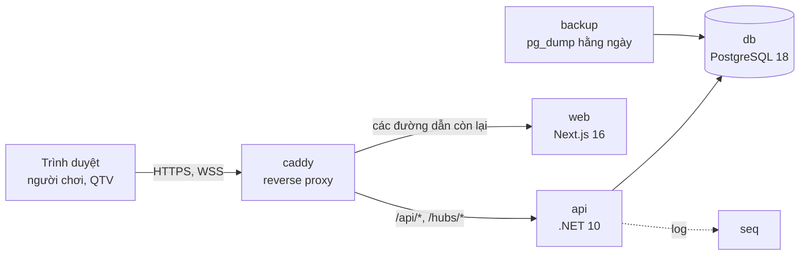
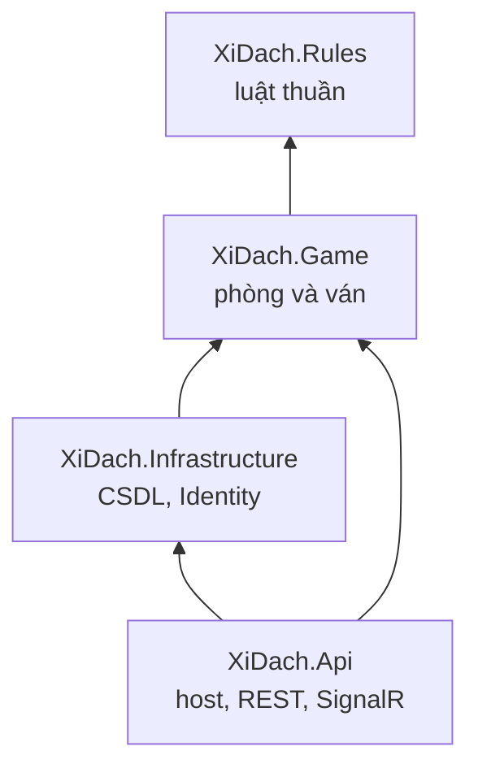
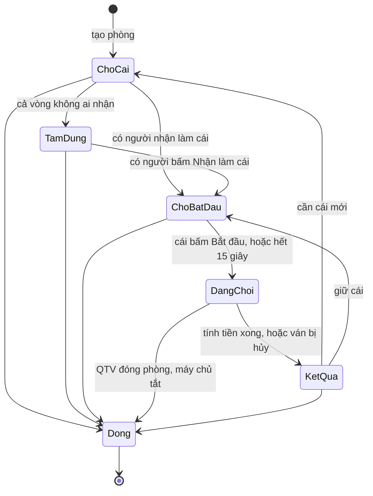
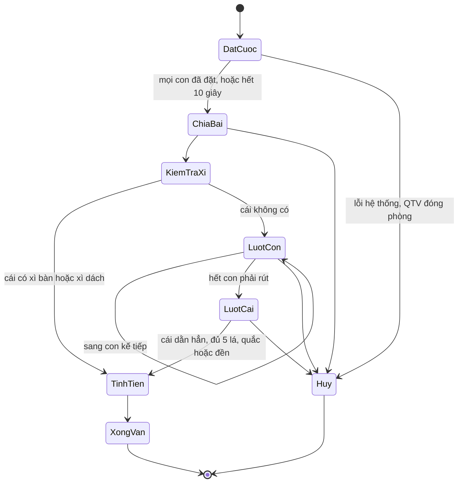
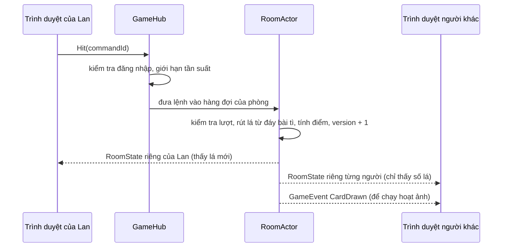
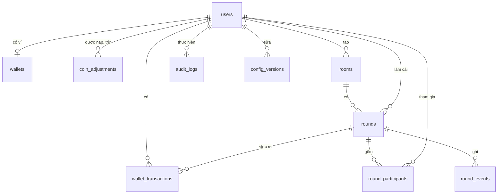

# Thiết kế hệ thống: game Xì Dách

Phiên bản 1.1 · 07/10/2026 · Trạng thái: **đã chốt**

Đây là bước 2 trong [quy trình phát triển](00-quy-trinh-phat-trien.md), dựa trên [phân tích yêu cầu 1.0](01-phan-tich-yeu-cau.md) và [luật chơi 0.7](luat-xi-dach.md). Mã trong ngoặc vuông, ví dụ [GAME-05], là yêu cầu mà phần thiết kế đó đáp ứng.

## 1. Nguyên tắc thiết kế

1. **Máy chủ quyết định mọi thứ.** Trình duyệt chỉ gửi ý định (rút, dằn, xét…) và hiển thị trạng thái do máy chủ gửi về. [FAIR-01]
2. **Mỗi phòng xử lý tuần tự.** Mọi lệnh của một phòng (hành động người chơi, hết giờ, rớt mạng) đi qua một hàng đợi riêng và được xử lý lần lượt. Nhờ vậy không có tranh chấp dữ liệu và không cần khóa. [REL-03]
3. **Luật chơi là thư viện thuần.** Tính điểm, so bài và tính tiền nằm trong một thư viện không phụ thuộc web, cơ sở dữ liệu hay đồng hồ, nên kiểm thử được trọn vẹn. [MAIN-01, MAIN-02]
4. **Xu chỉ thay đổi qua sổ giao dịch**, và kết quả mỗi ván được ghi trong đúng một giao dịch cơ sở dữ liệu. [REL-01, REL-02]
5. **Đơn giản đúng mức.** Quy mô là 5 phòng trên 1 máy chủ, nên dùng một khối backend duy nhất, giữ trạng thái ván trong bộ nhớ, không cần Redis hay hàng đợi tin nhắn.

## 2. Công nghệ

| Thành phần | Lựa chọn | Ghi chú |
|---|---|---|
| Frontend | Next.js 16 (App Router), React 19, TypeScript | build dạng standalone để chạy trong Docker |
| Giao diện | Tailwind CSS 4; shadcn/ui cho các trang thường; Motion cho hoạt ảnh trên bàn chơi | |
| Dữ liệu phía trình duyệt | TanStack Query cho REST; Zustand cho trạng thái bàn chơi; Zod để kiểm tra form | |
| Kết nối thời gian thực | ASP.NET Core SignalR (WebSocket) và thư viện `@microsoft/signalr` | tự kết nối lại, nhóm theo phòng, dùng chung cookie đăng nhập |
| Backend | .NET 10 (LTS, hỗ trợ đến 11/2028), ASP.NET Core Minimal API | |
| Xác thực | ASP.NET Core Identity, đăng nhập bằng cookie | có sẵn băm mật khẩu, khóa khi nhập sai nhiều lần, security stamp |
| Truy cập dữ liệu | EF Core 10 với Npgsql | migration có phiên bản [MAIN-05] |
| Cơ sở dữ liệu | PostgreSQL 18 | |
| Kiểm tra đầu vào phía máy chủ | FluentValidation | |
| Tài liệu API | OpenAPI do ASP.NET Core sinh tự động | frontend sinh kiểu TypeScript từ đây |
| Log và giám sát | Serilog (JSON) gửi về Seq | Seq vừa để xem log vừa để vẽ biểu đồ số liệu |
| Reverse proxy | Caddy 2 | tự xin và gia hạn chứng chỉ HTTPS |
| Kiểm thử | xUnit, Shouldly, FsCheck, Testcontainers, Vitest, Playwright | xem mục 11 |
| CI/CD | GitHub Actions, GitHub Container Registry | mã nguồn ở repo GitHub riêng tư (D2) |
| Node.js | 24 LTS (hỗ trợ đến 04/2028) | để build và chạy Next.js |

## 3. Kiến trúc tổng thể

### 3.1 Sơ đồ thành phần



- Trình duyệt chỉ làm việc với một tên miền. Caddy chuyển `/api/*` và `/hubs/*` sang backend, các đường dẫn còn lại sang Next.js. Vì cùng tên miền nên cookie đăng nhập dùng được cho cả REST lẫn SignalR, và không cần cấu hình CORS.
- Next.js chỉ phục vụ giao diện; mọi dữ liệu đều do backend .NET cung cấp.
- Trạng thái của các phòng và ván đang chơi nằm trong bộ nhớ của tiến trình `api`. Cơ sở dữ liệu lưu tài khoản, ví, phòng, nhật ký và kết quả ván.

### 3.2 Các project backend



| Project | Trách nhiệm |
|---|---|
| XiDach.Rules | lá bài, xào bài, tính điểm, phân loại bài, so bài, tính tiền (luật mục 3, 4, 7, 8) |
| XiDach.Game | quản lý phòng; máy trạng thái của phòng và ván; hàng đợi lệnh; đồng hồ; tự chơi khi hết giờ; dựng góc nhìn riêng cho từng người. Giao tiếp ra ngoài qua interface (lưu ván, phát tin, đồng hồ, xào bài) |
| XiDach.Infrastructure | EF Core DbContext và migration; Identity; sổ giao dịch xu; lưu ván; cấu hình hệ thống; dữ liệu khởi tạo [SYS-04] |
| XiDach.Api | Program.cs; các endpoint REST; GameHub; xác thực, phân quyền, giới hạn tần suất; log; health check; các tác vụ nền (đối soát xu, áp dụng lệnh nạp/trừ đang chờ) |

### 3.3 Cấu trúc thư mục dự án

```
/
├── docs/                  tài liệu theo từng bước
├── assets/cards/          ảnh bài gốc (SVG, PNG)
├── backend/
│   ├── XiDach.sln
│   ├── src/               4 project ở mục 3.2
│   └── tests/             XiDach.Rules.Tests, XiDach.Game.Tests, XiDach.Api.Tests, XiDach.LoadTest
├── frontend/              Next.js
│   ├── src/app/           các trang (mục 3.4)
│   ├── src/components/    thành phần giao diện, gồm cả bàn chơi
│   ├── src/lib/           gọi API, kết nối SignalR
│   ├── src/stores/        trạng thái bàn chơi
│   └── public/            ảnh bài WebP, ảnh đại diện, âm thanh
├── deploy/                compose.yaml, compose.dev.yaml, Caddyfile, script sao lưu, .env.example
└── .github/workflows/     CI/CD
```

### 3.4 Các trang của frontend

| Đường dẫn | Trang | Yêu cầu |
|---|---|---|
| /login | đăng nhập | PUB-01, AUTH-03 |
| /change-password | đổi mật khẩu, kể cả khi bị bắt buộc | AUTH-06, AUTH-12 |
| /terms | đồng ý điều khoản ở lần đăng nhập đầu | PUB-03 |
| /lobby | sảnh | LOB-01…05 |
| /rooms/[code] | bàn chơi | ROOM-*, GAME-* |
| /profile | hồ sơ, cài đặt, thống kê | PROF-01…04, HIS-03 |
| /wallet | số dư và lịch sử giao dịch | WAL-01 |
| /history, /history/[id] | lịch sử ván, xem lại một ván | HIS-01, HIS-02 |
| /rules | hướng dẫn luật chơi | PUB-02 |
| /admin/… | quản trị: tổng quan, người dùng, phòng, ván, cấu hình, nhật ký, thông báo | ADM-* |

- Đường dẫn viết bằng tiếng Anh cho gọn trong mã nguồn; mọi chữ trên giao diện là tiếng Việt [USA-01].
- Thiết kế giao diện chi tiết thuộc bước 3, gồm các yêu cầu về hiển thị và trải nghiệm [USA-02…05, COMP-01, COMP-02].
- Proxy (middleware) của Next.js chỉ kiểm tra có cookie đăng nhập hay không để chuyển nhanh về /login. Việc kiểm tra quyền thật sự luôn nằm ở backend.
- Ảnh bài lấy từ `assets/cards/svg`, xuất thành WebP 360×540 (khoảng 15–40 KB mỗi lá) đặt trong `public/cards`, được tải trước khi vào phòng và lưu cache lâu dài [PERF-03].

## 4. Máy chạy phòng và ván (XiDach.Game)

### 4.1 Mô hình

- **RoomManager** (một đối tượng duy nhất): danh sách phòng đang mở, tối đa theo cấu hình (mặc định 5) [LOB-03]; tìm phòng theo mã; ghi nhận mỗi tài khoản đang ở phòng nào [AUTH-09].
- **RoomActor** (mỗi phòng một đối tượng): giữ toàn bộ trạng thái của phòng và ván đang chơi. Mọi lệnh được đưa vào một `Channel` và xử lý lần lượt trên tác vụ nền riêng của phòng.
- **Chống xử lý lặp:** mỗi lệnh mang một `commandId` do trình duyệt sinh; phòng nhớ các `commandId` đã xử lý gần đây và bỏ qua lệnh gửi lặp [REL-03].
- **Đồng hồ:** dùng `TimeProvider` của .NET, khi kiểm thử thay bằng đồng hồ giả để tua thời gian. Mỗi lần hẹn giờ gắn với một mã pha; nếu lúc hết giờ phòng đã sang pha khác thì lệnh hết giờ bị bỏ qua [SYS-01].
- **Xào bài:** qua interface `IShuffler`. Bản thật dùng `RandomNumberGenerator.GetInt32` theo Fisher–Yates [FAIR-03]; bản kiểm thử nhận một bộ bài định sẵn.
- **Số dư:** RoomActor giữ bản sao số dư của người ngồi ghế, đọc lại từ cơ sở dữ liệu khi bắt đầu mỗi ván và cập nhật sau khi tính tiền. Trong lúc ván đang chơi, số dư của người trong ván không thay đổi từ nơi khác (mục 4.5).

### 4.2 Máy trạng thái của phòng



| Trạng thái | Ý nghĩa | Thời gian |
|---|---|---|
| ChoCai | chưa có cái; lần lượt hỏi những người đang ngồi ghế có nhận làm cái không | 10 giây mỗi người |
| TamDung | cả vòng không ai nhận; mọi người ngồi ghế thấy nút "Nhận làm cái" | không giới hạn |
| ChoBatDau | đã có cái; khi có ít nhất 1 con đủ điều kiện thì bắt đầu đếm ngược | 15 giây |
| DangChoi | đang chơi một ván (mục 4.3) | |
| KetQua | hiện bảng kết quả | 5 giây |
| Dong | phòng đã đóng | |

**Thứ tự hỏi làm cái** (luật 5.2, 5.3): lần đầu mở phòng thì hỏi chủ phòng trước, ở cả hai chế độ (D4); các lần sau hỏi từ người ngồi ngay sau cái cũ, theo vòng bàn. Người bật "Không nhận làm cái" hoặc không đủ xu tối thiểu thì bị bỏ qua.

**Phòng đóng khi:** không còn ai ngồi ghế trong 5 phút [ROOM-12]; QTV đóng phòng [ADM-08]; máy chủ tắt [REL-04].

### 4.3 Máy trạng thái của ván



| Pha | Việc máy chủ làm | Thời gian |
|---|---|---|
| DatCuoc | bàn cố định: đặt cược ngay; bàn tự do: nhận lệnh đặt cược, hết giờ thì đặt theo luật 5.4 | 10 giây |
| ChiaBai | xào bài; ghi bản ghi ván kèm thứ tự bộ bài và mã băm; chia theo luật 6.2 | tức thì |
| KiemTraXi | xử lý theo luật 6.3 | tức thì |
| LuotCon | lần lượt từng con chưa chốt; Rút lấy lá từ đáy bài tì; lượt tự kết thúc khi quắc, đền hoặc đủ 5 lá. Không còn con nào phải rút thì bỏ qua pha này | 15 giây mỗi quyết định |
| LuotCai | Rút; Xét một con khi tổng từ 15; Dằn hẳn để lật hết các con còn lại. Không còn con nào chưa chốt thì bỏ qua pha này | 15 giây mỗi quyết định |
| TinhTien | gọi thư viện luật để tính tiền (mục 7); ghi kết quả trong một giao dịch cơ sở dữ liệu | tức thì |
| XongVan | phát kết quả, áp dụng các lệnh nạp/trừ xu đang chờ | |
| Huy | hủy ván theo luật 6.7: không ai được hay mất xu | |

### 4.4 Góc nhìn riêng của từng người [FAIR-02]

`RoomViewBuilder` dựng trạng thái phòng riêng cho từng người xem:

- **Bài của chính mình:** thấy đủ các lá và tổng nút.
- **Bài của con khác:** chỉ thấy số lá, cho đến khi bài được lật (lật xì bàn, xì dách từ đầu; bị xét; hoặc cuối ván).
- **Bài của cái:** chỉ thấy số lá cho đến cuối ván, kể cả lúc cái xét (D5).
- **Bộ bài và các lá chưa chia:** không bao giờ được gửi xuống trình duyệt.

Một kiểm thử tự động ghi lại toàn bộ tin nhắn gửi cho một người trong suốt một ván và khẳng định không có lá nào người đó không được phép thấy.

### 4.5 Các tình huống đặc biệt

| Tình huống | Cách xử lý |
|---|---|
| Rớt mạng | ghế được đánh dấu mất kết nối; đồng hồ vẫn chạy; hết giờ thì game tự chơi theo luật 6.4, 6.5 [GAME-09] |
| Kết nối lại | trình duyệt tự kết nối lại và gọi lại JoinRoom để nhận toàn bộ trạng thái hiện tại [GAME-09] |
| Mở thêm tab hoặc thiết bị | kết nối mới tiếp quản; kết nối cũ nhận ForceLogout và bị gỡ khỏi phòng [AUTH-09] |
| Vào phòng khác khi đang ở một phòng | coi như rời phòng cũ (ROOM-03) rồi vào phòng mới |
| QTV khóa tài khoản hoặc đặt lại mật khẩu | đổi security stamp và ngắt ngay mọi kết nối SignalR của người đó; phần ván đang chơi do game tự chơi [AUTH-08, ADM-07] |
| QTV nạp hoặc trừ xu cho người đang trong ván | lệnh được ghi vào bảng `coin_adjustments` ở trạng thái chờ và được áp dụng ngay khi ván kết thúc [ADM-06] |
| Máy chủ tắt có kế hoạch | hủy các ván đang chơi, báo cho người chơi, đóng phòng |
| Máy chủ khởi động lại sau sự cố | lúc khởi động: mọi ván `in_progress` chuyển thành `cancelled`, mọi phòng `open` chuyển thành `closed` [REL-04, GAME-11] |
| Ghi kết quả ván bị lỗi | thử lại 3 lần; vẫn lỗi thì hủy ván và ghi log mức Critical |

## 5. Giao tiếp giữa trình duyệt và máy chủ

### 5.1 Quy ước chung

- **REST:** JSON, tên trường camelCase. Lỗi trả về theo chuẩn Problem Details (RFC 9457), có thêm trường `code` (mục 5.5).
- **Kiểu dữ liệu dùng chung:** kiểu TypeScript cho REST được sinh từ tài liệu OpenAPI; kiểu cho hub được sinh từ interface C# của hub, để frontend và backend không lệch nhau.
- **Thời gian:** chuỗi ISO 8601 theo UTC; trình duyệt tự đổi sang giờ Việt Nam [USA-06]. Trạng thái phòng có kèm giờ máy chủ để trình duyệt tính lệch đồng hồ khi đếm ngược.
- **Xu:** số nguyên.
- **Lá bài:** viết bằng mã giống tên file ảnh, gồm hạng và chất, ví dụ `AS`, `10H`, `QD`.

### 5.2 REST API

**Xác thực (`/api/auth`)**

| Phương thức | Đường dẫn | Việc làm | Quyền | Yêu cầu |
|---|---|---|---|---|
| POST | /api/auth/login | đăng nhập; gửi `userName`, `password`, `rememberMe` | khách | AUTH-03 |
| POST | /api/auth/logout | đăng xuất | đã đăng nhập | AUTH-04 |
| GET | /api/auth/me | thông tin phiên: id, tên, vai trò, có phải đổi mật khẩu không, đã đồng ý điều khoản chưa, số dư | đã đăng nhập | AUTH-12, PUB-03 |
| POST | /api/auth/change-password | đổi mật khẩu; gửi `currentPassword`, `newPassword` | đã đăng nhập | AUTH-06, AUTH-12 |
| POST | /api/auth/accept-terms | đồng ý điều khoản | người chơi | PUB-03 |
| GET | /api/auth/antiforgery | lấy token chống CSRF | mọi người | SEC-05 |

**Người chơi (`/api/me`, `/api/users`)**

| Phương thức | Đường dẫn | Việc làm | Yêu cầu |
|---|---|---|---|
| GET | /api/me/profile | hồ sơ và thống kê | PROF-01, HIS-03 |
| PUT | /api/me/profile | đổi tên hiển thị, ảnh đại diện | PROF-02 |
| GET, PUT | /api/me/settings | âm thanh, "Không nhận làm cái" | PROF-04 |
| GET | /api/me/transactions | lịch sử giao dịch; lọc theo loại và thời gian; phân trang | WAL-01 |
| GET | /api/me/rounds | lịch sử ván; phân trang | HIS-01 |
| GET | /api/me/rounds/{roundId} | xem lại một ván, chỉ gồm thông tin người đó được phép thấy | HIS-02 |
| GET | /api/users/{id}/card | hồ sơ công khai của người khác | PROF-03 |

**Phòng và dữ liệu chung**

| Phương thức | Đường dẫn | Việc làm | Yêu cầu |
|---|---|---|---|
| GET | /api/rooms | danh sách phòng lúc mới vào sảnh; sau đó cập nhật qua hub | LOB-01 |
| POST | /api/rooms | tạo phòng | LOB-03 |
| GET | /api/rooms/{code} | thông tin cơ bản của phòng, có cần mật khẩu không | LOB-04 |
| POST | /api/rooms/quick-join | chơi nhanh | LOB-05 |
| GET | /api/config/public | khoảng mức cược, thời gian các đồng hồ, số phòng tối đa | LOB-03 |
| GET | /api/announcements/active | thông báo đang hiệu lực | ADM-12 |

**Quản trị (`/api/admin`, chỉ QTV)**

Mọi thao tác làm thay đổi dữ liệu đều được ghi nhật ký quản trị trong cùng giao dịch cơ sở dữ liệu [ADM-11].

| Phương thức | Đường dẫn | Việc làm | Yêu cầu |
|---|---|---|---|
| GET | /api/admin/dashboard | số liệu tổng quan | ADM-02 |
| GET | /api/admin/users | tìm, lọc, phân trang | ADM-03 |
| POST | /api/admin/users | tạo tài khoản, kèm số xu ban đầu nếu là người chơi; trả về mật khẩu tạm đúng một lần | ADM-15, WAL-02 |
| GET | /api/admin/users/{id} | chi tiết tài khoản | ADM-03 |
| GET | /api/admin/users/{id}/transactions | lịch sử giao dịch | ADM-03 |
| GET | /api/admin/users/{id}/rounds | lịch sử ván | ADM-03 |
| POST | /api/admin/users/{id}/lock | khóa, kèm thời hạn và lý do | ADM-04 |
| POST | /api/admin/users/{id}/unlock | mở khóa | ADM-04 |
| POST | /api/admin/users/{id}/reset-password | đặt mật khẩu tạm | ADM-07 |
| PUT | /api/admin/users/{id}/role | đổi vai trò | ADM-05 |
| POST | /api/admin/users/{id}/coins | nạp (số dương) hoặc trừ (số âm), kèm lý do | ADM-06 |
| DELETE | /api/admin/users/{id} | xóa mềm | ADM-16 |
| GET | /api/admin/rooms | các phòng đang mở | ADM-08 |
| GET | /api/admin/rooms/{code} | trạng thái công khai của bàn | ADM-08 |
| POST | /api/admin/rooms/{code}/close | đóng phòng, kèm lý do | ADM-08 |
| GET | /api/admin/rounds | tra cứu ván | ADM-09 |
| GET | /api/admin/rounds/{id} | toàn bộ diễn biến, kể cả bộ bài; chỉ khi ván đã kết thúc | ADM-09 |
| GET, PUT | /api/admin/config | xem cấu hình; sửa thì tạo phiên bản mới | ADM-10 |
| GET | /api/admin/config/history | lịch sử cấu hình | ADM-10 |
| GET | /api/admin/audit-logs | nhật ký quản trị | ADM-11 |
| GET, POST, DELETE | /api/admin/announcements | thông báo hệ thống | ADM-12 |
| PUT | /api/admin/maintenance | bật, tắt chế độ bảo trì | ADM-13 |

**Kiểm tra sức khỏe**

| Đường dẫn | Ghi chú | Yêu cầu |
|---|---|---|
| /health/live | công khai, để dịch vụ giám sát uptime gọi | REL-05 |
| /health/ready | chỉ trong mạng nội bộ Docker; kiểm tra cả cơ sở dữ liệu | OPS-02 |

### 5.3 SignalR hub `/hubs/game`

Chỉ tài khoản người chơi được kết nối; hub từ chối tài khoản QTV [AUTH-07]. Mọi lệnh làm thay đổi trạng thái đều kèm `commandId`.

**Lệnh từ trình duyệt**

| Lệnh | Ai được gọi | Việc làm | Yêu cầu |
|---|---|---|---|
| SubscribeLobby, UnsubscribeLobby | người chơi | nhận hoặc thôi nhận cập nhật danh sách phòng | LOB-01 |
| JoinRoom(code, password) | người chơi | vào phòng làm người xem và nhận trạng thái phòng | LOB-04, GAME-09 |
| LeaveRoom() | người trong phòng | rời phòng | ROOM-03 |
| TakeSeat(seat) | người xem | ngồi vào ghế trống | ROOM-01 |
| StandUp() | người ngồi ghế | đứng dậy | ROOM-02 |
| RespondDealerOffer(accept) | người đang được hỏi | nhận hoặc từ chối làm cái | ROOM-06 |
| ClaimDealer() | người ngồi ghế, khi phòng đang TamDung | nhận làm cái | ROOM-06 |
| ResignDealer() | cái | xin nghỉ sau ván đang chơi | luật 5.3 |
| AppointDealer(userId) | chủ phòng, chế độ cái cố định | chỉ định cái mới | ROOM-07 |
| TransferOwnership(userId) | chủ phòng | chuyển quyền chủ phòng | ROOM-08 |
| Kick(userId) | chủ phòng | mời ra khỏi phòng | ROOM-09 |
| StartRound() | cái | bắt đầu ván | GAME-01 |
| PlaceBet(amount) | con, trong pha DatCuoc | đặt cược | GAME-02 |
| Hit() | con đang tới lượt, hoặc cái trong lượt cái | rút một lá | GAME-05, GAME-06 |
| Stand(confirmNon) | con đang tới lượt | dằn; nếu dưới 16 nút thì `confirmNon` phải là true | GAME-05 |
| Reveal(seat) | cái, khi tổng từ 15 | xét một con | GAME-06 |
| DealerStand(confirmNon) | cái | dằn hẳn và lật các con còn lại; nếu dưới 15 nút thì `confirmNon` phải là true | GAME-06 |

**Sự kiện từ máy chủ**

| Sự kiện | Gửi cho | Nội dung |
|---|---|---|
| RoomState | từng người trong phòng, mỗi người một bản riêng | toàn bộ trạng thái phòng theo góc nhìn của người đó, kèm số `version` tăng dần |
| GameEvent | cả phòng | sự kiện để chạy hoạt ảnh và âm thanh: CardDealt, CardDrawn, Stood, Revealed, RoundStarted, RoundSettled, RoundCancelled, DealerChanged… |
| DealerOffer | người đang được hỏi | lời mời làm cái, kèm hạn trả lời |
| LobbyRooms | người đang ở sảnh | danh sách phòng mỗi khi có thay đổi |
| ForceLogout | một người | lý do: bị khóa, mật khẩu đã đổi, phiên khác tiếp quản |
| CommandRejected | người gửi lệnh | mã lỗi khi lệnh không hợp lệ |

Sau mỗi thay đổi, máy chủ gửi lại toàn bộ trạng thái cho từng người, thay vì chỉ gửi phần thay đổi. Cách này đơn giản, tự sửa sai nếu trình duyệt lỡ một tin, và kết nối lại không cần xử lý riêng. Một phòng có tối đa 28 kết nối, mỗi bản trạng thái vài KB, nên chi phí không đáng kể.

### 5.4 Ví dụ trạng thái phòng gửi cho một người

Người xem là Lan, ngồi ghế 1, đang tới lượt rút:

```json
{
  "version": 42,
  "serverTime": "2026-10-07T08:15:12Z",
  "room": {
    "code": "K7M2QX", "name": "Bàn vui", "ownerId": "…",
    "dealerMode": "rotation", "roundsPerTurn": 3,
    "betMode": "free", "betMin": 100, "betMax": 1000
  },
  "state": "DangChoi",
  "round": { "id": "…", "phase": "LuotCon", "turnSeat": 1, "deadline": "2026-10-07T08:15:25Z", "deckHash": "…" },
  "seats": [
    { "seat": 0, "displayName": "Nam", "isDealer": true, "balance": 9500, "connected": true,
      "hand": { "count": 2 } },
    { "seat": 1, "displayName": "Lan", "balance": 10200, "bet": 200,
      "hand": { "count": 3, "cards": ["AS", "5D", "6C"], "points": 21, "kind": "Normal" } },
    { "seat": 2, "displayName": "Hùng", "balance": 4800, "bet": 200,
      "hand": { "count": 2 }, "result": null }
  ],
  "you": { "seat": 1, "actions": ["Hit", "Stand"] },
  "spectatorCount": 3
}
```

### 5.5 Mã lỗi

| Mã | HTTP | Khi nào |
|---|---|---|
| INVALID_CREDENTIALS | 401 | sai tên đăng nhập hoặc mật khẩu |
| ACCOUNT_LOCKED | 423 | bị khóa do nhập sai nhiều lần hoặc do QTV khóa; kèm thời hạn và lý do |
| PASSWORD_CHANGE_REQUIRED | 403 | phải đổi mật khẩu trước |
| TERMS_NOT_ACCEPTED | 403 | phải đồng ý điều khoản trước |
| FORBIDDEN | 403 | không có quyền |
| VALIDATION_FAILED | 400 | dữ liệu không hợp lệ; kèm lỗi theo từng trường |
| NOT_FOUND | 404 | không tìm thấy |
| USERNAME_TAKEN, DISPLAY_NAME_TAKEN | 409 | tên bị trùng |
| ROOM_LIMIT_REACHED | 409 | đã đủ số phòng tối đa |
| ROOM_FULL, SPECTATORS_FULL | 409 | hết ghế, hết chỗ xem |
| ROOM_PASSWORD_INVALID | 403 | sai mật khẩu phòng |
| INSUFFICIENT_BALANCE | 409 | không đủ xu tối thiểu |
| LAST_ADMIN | 409 | thao tác sẽ làm hệ thống không còn QTV |
| USER_IN_ROUND | 409 | người đó đang trong ván (ví dụ khi xóa tài khoản) |
| NOT_YOUR_TURN, INVALID_ACTION | (hub) | lệnh sai lượt hoặc không hợp lệ ở pha hiện tại |
| RATE_LIMITED | 429 | vượt giới hạn tần suất |
| INTERNAL_ERROR | 500 | lỗi không lường trước; chi tiết chỉ ghi vào log |

### 5.6 Luồng xử lý một hành động



## 6. Cơ sở dữ liệu

### 6.1 Sơ đồ quan hệ



### 6.2 Các bảng

Quy ước: tên bảng và cột dạng snake_case; thời gian dùng `timestamptz` (UTC); số xu dùng `bigint`; khóa chính dạng uuid dùng `uuidv7()` của PostgreSQL 18.

**users** (bảng người dùng của ASP.NET Core Identity, thêm cột riêng)

| Cột | Kiểu | Ràng buộc, ghi chú |
|---|---|---|
| id | uuid | khóa chính |
| user_name, normalized_user_name | varchar(20) | normalized_user_name duy nhất [ADM-15] |
| display_name | varchar(20) | duy nhất theo chữ thường, bỏ qua tài khoản đã xóa [PROF-02] |
| password_hash | text | [SEC-01] |
| security_stamp, concurrency_stamp | text | security stamp đổi khi khóa, đặt lại hoặc đổi mật khẩu |
| must_change_password | boolean | mặc định true [AUTH-12] |
| terms_accepted_at | timestamptz | null nếu chưa đồng ý [PUB-03] |
| lockout_end, access_failed_count, lockout_enabled | | khóa do nhập sai mật khẩu [AUTH-03] |
| locked_until | timestamptz | null là không khóa; `infinity` là khóa vĩnh viễn [ADM-04] |
| lock_reason | text | |
| avatar_id | smallint | [PROF-02] |
| settings | jsonb | ví dụ `{"soundOn": true, "autoDeclineDealer": false}` [PROF-04] |
| is_deleted, deleted_at | boolean, timestamptz | xóa mềm [ADM-16] |
| created_at, created_by, last_login_at | | |

Vai trò dùng các bảng chuẩn của Identity (`roles`, `user_roles`) với 2 vai trò `Player` và `Admin`.

**wallets** (chỉ người chơi có ví)

| Cột | Kiểu | Ràng buộc, ghi chú |
|---|---|---|
| user_id | uuid | khóa chính, khóa ngoại tới users |
| balance | bigint | not null, `CHECK (balance >= 0)` |
| updated_at | timestamptz | |

**wallet_transactions** (sổ giao dịch, chỉ thêm, không sửa xóa) [WAL-01, REL-01]

| Cột | Kiểu | Ràng buộc, ghi chú |
|---|---|---|
| id | bigint identity | khóa chính |
| user_id | uuid | khóa ngoại |
| type | text | `initial`, `admin_credit`, `admin_debit`, `round_win`, `round_loss` |
| amount | bigint | khác 0; dương là cộng, âm là trừ |
| balance_after | bigint | ≥ 0 |
| round_id | uuid | khóa ngoại, null nếu không do ván |
| admin_id | uuid | khóa ngoại, null nếu không do QTV |
| reason | text | lý do của QTV |
| created_at | timestamptz | |

Chỉ mục: `(user_id, created_at DESC)`.

**coin_adjustments** (lệnh nạp, trừ xu của QTV) [ADM-06]

| Cột | Kiểu | Ràng buộc, ghi chú |
|---|---|---|
| id | bigint identity | khóa chính |
| user_id, admin_id | uuid | khóa ngoại |
| amount | bigint | khác 0 |
| reason | text | not null |
| status | text | `pending`, `applied`, `rejected` |
| reject_reason | text | ví dụ trừ quá số dư lúc áp dụng |
| transaction_id | bigint | giao dịch đã sinh ra khi áp dụng |
| created_at, applied_at | timestamptz | |

**rooms**

| Cột | Kiểu | Ràng buộc, ghi chú |
|---|---|---|
| id | uuid | khóa chính |
| code | char(6) | duy nhất trong các phòng đang mở; bỏ các ký tự dễ nhầm như 0, O, 1, I |
| name | varchar(30) | |
| owner_id | uuid | người tạo phòng |
| dealer_mode | text | `fixed` hoặc `rotation` |
| rounds_per_turn | smallint | 1–10, chỉ dùng với `rotation` |
| bet_mode | text | `fixed` hoặc `free` |
| bet_amount, bet_min, bet_max | bigint | ràng buộc CHECK theo `bet_mode` |
| password_hash | text | null nếu không có mật khẩu |
| config | jsonb | bản sao cấu hình hệ thống lúc tạo phòng [ADM-10] |
| status | text | `open` hoặc `closed` |
| close_reason | text | |
| created_at, closed_at | timestamptz | |

**rounds** [GAME-12]

| Cột | Kiểu | Ràng buộc, ghi chú |
|---|---|---|
| id | uuid | khóa chính |
| room_id | uuid | khóa ngoại |
| round_no | int | duy nhất trong phòng |
| dealer_id | uuid | khóa ngoại |
| status | text | `in_progress`, `settled`, `cancelled` |
| deck | text | 52 mã lá theo thứ tự sau khi xào |
| deck_salt, deck_hash | text | mã băm SHA-256 của bộ bài kèm salt [FAIR-04] |
| started_at, ended_at | timestamptz | |
| cancel_reason | text | |

**round_participants** [HIS-01, HIS-03]

| Cột | Kiểu | Ràng buộc, ghi chú |
|---|---|---|
| round_id, user_id | uuid | khóa chính ghép |
| seat | smallint | ghế 0–7 |
| position | smallint | vị trí tính từ cái; cái là 0 |
| role | text | `dealer` hoặc `player` |
| bet | bigint | null với cái |
| cards | text | các lá cuối cùng |
| hand_kind | text | `XiBan`, `XiDach`, `NguLinh`, `Normal`, `Quac`, `Non`, `Den` |
| points | smallint | |
| outcome | text | `win`, `lose`, `draw`, `penalized`; null với cái |
| multiplier | smallint | |
| reveal_order | smallint | thứ tự được xét; null nếu lật lúc cuối ván |
| pair_amount | bigint | kết quả với cái; dương là con được |
| cover_amount | bigint | số trả thay cái (người bị phạt) |
| net | bigint | thay đổi số dư cuối cùng |

Chỉ mục: `(user_id, round_id)`.

**round_events** (chỉ thêm) [GAME-12]

| Cột | Kiểu | Ràng buộc, ghi chú |
|---|---|---|
| round_id, seq | uuid, int | khóa chính ghép |
| at | timestamptz | |
| type | text | Bet, Dealt, Hit, Stand, Reveal, DealerStand, Timeout, AutoAction, Disconnected… |
| actor_id | uuid | null với hành động của hệ thống |
| payload | jsonb | |

**config_versions** (chỉ thêm) [ADM-10]

| Cột | Kiểu | Ràng buộc, ghi chú |
|---|---|---|
| version | int identity | khóa chính; phiên bản mới nhất là cấu hình đang dùng |
| data | jsonb | các thông số ở luật mục 9, khoảng mức cược, số phòng tối đa, xu ban đầu mặc định |
| created_by | uuid | null với bản mặc định |
| created_at | timestamptz | |

**audit_logs** (chỉ thêm) [ADM-11]

| Cột | Kiểu | Ràng buộc, ghi chú |
|---|---|---|
| id | bigint identity | khóa chính |
| admin_id | uuid | khóa ngoại |
| action | text | ví dụ `user.create`, `user.lock`, `coins.adjust`, `room.close`, `config.update` |
| target_type, target_id | text | |
| before, after | jsonb | giá trị trước và sau |
| ip | inet | |
| created_at | timestamptz | |

Chỉ mục: `(created_at DESC)`, `(admin_id)`, `(target_type, target_id)`.

**announcements** [ADM-12]: id, message, starts_at, ends_at, created_by, created_at.

### 6.3 Bảo vệ dữ liệu

- **Chỉ thêm:** trigger chặn UPDATE và DELETE trên `wallet_transactions`, `round_events`, `audit_logs` và `config_versions`.
- **Quyền truy cập:** ứng dụng kết nối bằng một tài khoản cơ sở dữ liệu riêng, không phải superuser.
- **Ghi lúc bắt đầu ván:** thêm 1 dòng `rounds` kèm bộ bài, để vẫn tra được bộ bài nếu ván bị hủy giữa chừng.
- **Ghi lúc tính tiền:** trong cùng một giao dịch [REL-02]:
  - khóa các dòng `wallets` liên quan;
  - cập nhật số dư;
  - thêm `wallet_transactions`, `round_participants` và toàn bộ `round_events` của ván;
  - chuyển `rounds.status` thành `settled`.
  - Trước khi commit phải kiểm tra tổng `net` bằng 0; nếu không thì hủy giao dịch và hủy ván.
- **Xóa tài khoản:** xóa mềm thay tên đăng nhập và tên hiển thị bằng mã ẩn danh, đồng thời trừ hết số xu còn lại bằng một giao dịch `admin_debit` có lý do "xóa tài khoản" [ADM-16].
- **Đối soát hằng ngày lúc 03:00 giờ Việt Nam** [SYS-03]: kiểm tra (1) số dư mỗi ví bằng tổng `amount` của ví đó; (2) tổng `net` của mỗi ván đã tính tiền bằng 0. Có sai lệch thì ghi log mức Critical và hiện cảnh báo ở trang tổng quan quản trị.

## 7. Thuật toán tính tiền (XiDach.Rules)

### 7.1 Các thành phần

| Thành phần | Việc làm | Luật |
|---|---|---|
| `Card`, `Deck` | 52 lá; xào bằng Fisher–Yates | 6.1 |
| `HandEvaluator` | tính nút (A tính theo số lá), phân loại bài theo vai trò (con đủ tuổi từ 16, cái từ 15) và việc đã dằn hay chưa | 3, 4 |
| `HandComparer` | so bài con với cái, trả về bên thắng và hệ số; cái được ưu tiên khi cùng loại bài đặc biệt | 7, 8.1 |
| `Settlement` | tính số xu thay đổi của từng người trong ván | 8.2–8.4 |

### 7.2 Các bước tính tiền

**Đầu vào:**
- Với mỗi con: phần cược, bài, có lật xì bàn hay xì dách từ đầu không, kết quả đã chốt lúc xét (nếu có), có bị phạt không.
- Cái có bị phạt không.
- Số dư trước ván của mọi người.

**Các bước:**

1. **Kết quả từng cặp** (luật 7, 8.1): với mỗi con, kết quả bằng phần cược nhân hệ số bài của bên thắng; dương nếu con thắng, âm nếu cái thắng, 0 nếu hòa. Cặp nào đã chốt lúc xét thì giữ nguyên kết quả đó.
2. **Phân nhóm khoản cái thua:**
   - **A:** cái thua vì so bài thông thường trong pha rút bài.
   - **E:** cái thua các con lật xì từ đầu ván.
   - **L:** cái thua vì chính cái bị phạt (đền làng, luật 8.3).
3. **Người bị phạt** (luật 8.2):
   - Mỗi người bị phạt mất 1 phần cược cho cái.
   - Tổng A chia đều cho những người bị phạt. Phần lẻ từng xu chia lần lượt cho người có vị trí nhỏ hơn.
   - Phần của mỗi người tối đa bằng 12 lần phần cược của chính họ; phần vượt quá thì cái trả.
   - Các khoản E và L luôn do cái trả.
4. **Dựng danh sách khoản chuyển xu** (ai trả ai, bao nhiêu) và tính `net` của từng người. Tổng `net` phải bằng 0.
5. **Không đủ xu** (luật 8.4):
   - Nếu có người mà số dư trước ván cộng `net` nhỏ hơn 0, người đó chỉ trả tối đa số xu đang có, đã tính cả số vừa thắng trong ván.
   - Các khoản người đó phải trả được giảm theo tỉ lệ, nên những người nhận được ít đi tương ứng.
   - Lặp lại cho đến khi không còn ai âm (tối đa bằng số người trong ván). Làm tròn xuống; phần lẻ chia theo vị trí để tổng vẫn bằng 0.

### 7.3 Bất biến được kiểm thử

Dùng FsCheck sinh hàng nghìn ván ngẫu nhiên và kiểm tra:

- Tổng `net` của mọi người trong ván bằng 0.
- Không ai bị âm số dư sau ván.
- Con không bị phạt mất tối đa 2 phần cược của mình.
- Người bị phạt mất tối đa 13 phần cược của mình.
- Mọi ví dụ trong luật đều cho đúng kết quả, ví dụ bảng ở luật 8.2: con 1 +10, con 2 −10, con 3 −40, con 4 +20, cái +20.

## 8. Bảo mật

| Chủ đề | Thiết kế | Yêu cầu |
|---|---|---|
| Mật khẩu | PasswordHasher của Identity (PBKDF2); mật khẩu dài từ 8 ký tự, có cả chữ và số; mật khẩu tạm cũng chỉ lưu dạng băm | SEC-01, AUTH-06 |
| Phiên đăng nhập | cookie `xd_auth`: HttpOnly, Secure, SameSite=Lax. Có "Ghi nhớ đăng nhập" thì giữ 30 ngày, không thì là cookie phiên. Security stamp được kiểm tra lại mỗi 1 phút | SEC-02, AUTH-03 |
| Khóa do nhập sai mật khẩu | lockout của Identity: sai 5 lần thì khóa 15 phút | AUTH-03 |
| QTV khóa tài khoản, đặt lại mật khẩu; người dùng đổi mật khẩu | đổi security stamp để các phiên khác hết hiệu lực; ngắt ngay kết nối SignalR | AUTH-06, AUTH-08, ADM-07 |
| Bắt buộc đổi mật khẩu, đồng ý điều khoản | bộ lọc ở API và hub: khi chưa xong thì chỉ cho gọi `me`, `change-password`, `accept-terms`, `logout` | AUTH-12, PUB-03 |
| Phân quyền | 2 policy `Player` và `Admin`; hub từ chối tài khoản QTV; RoomActor kiểm tra mọi lệnh theo vai trò (cái, con, chủ phòng) và pha hiện tại | AUTH-07, SEC-04 |
| CSRF | mọi POST, PUT, DELETE của REST phải gửi token chống CSRF qua header `X-XSRF-TOKEN`; hub kiểm tra header `Origin` | SEC-05 |
| Giới hạn tần suất | middleware RateLimiter: đăng nhập 10 lần mỗi phút mỗi IP; bộ lọc của hub: 10 lệnh mỗi giây mỗi người | SEC-03 |
| Header bảo mật | Caddy thêm HSTS, X-Content-Type-Options, Referrer-Policy; Next.js thêm Content-Security-Policy có nonce và chặn nhúng trang vào iframe | SEC-05 |
| Bí mật | file `.env` trên máy chủ (quyền 600), không commit; CI quét bí mật bằng gitleaks | SEC-06 |
| Thư viện | CI chạy `dotnet list package --vulnerable` và `npm audit` | SEC-07 |
| Bài úp | góc nhìn riêng (mục 4.4) | FAIR-02 |
| Xào bài | CSPRNG theo Fisher–Yates; mã băm của bộ bài kèm salt được công bố trước ván, bộ bài và salt được công bố sau ván | FAIR-03, FAIR-04 |
| Dữ liệu khởi tạo | tên đăng nhập và mật khẩu của 6 tài khoản tạo sẵn lấy từ biến môi trường; tài khoản chỉ được tạo nếu chưa tồn tại | SYS-04, SEC-06 |
| Công cụ kiểm thử | endpoint đặt bộ bài định sẵn chỉ được đăng ký khi chạy ở môi trường Testing, không bao giờ có trên production | FAIR-01 |
| Nhiều tài khoản cùng bàn | ghi IP khi kết nối hub; lúc bắt đầu ván, nếu có từ 2 tài khoản cùng IP ngồi chung bàn thì ghi cảnh báo cho QTV | FAIR-05 |
| Dữ liệu cá nhân, tiền thật | bảng `users` không có email hay giấy tờ tùy thân; hệ thống không có chức năng thanh toán hay chuyển xu giữa người chơi | LEGAL-01, LEGAL-02 |
| Dùng nội bộ | `robots.txt` chặn mọi bot và mọi trang có thẻ `noindex`, để website không xuất hiện trên công cụ tìm kiếm | LEGAL-03 |

## 9. Hiệu năng

- **Tải dự kiến:** 5 phòng, mỗi phòng tối đa 28 kết nối (8 người ngồi và 20 người xem), tổng 140 kết nối; vài lệnh mỗi giây.
- **Xử lý lệnh:** mỗi lệnh xử lý trong bộ nhớ, dưới 1 ms. Mỗi thay đổi gửi tối đa 28 bản trạng thái, mỗi bản vài KB [PERF-01].
- **Cơ sở dữ liệu:** mỗi ván chỉ ghi 2 lần (bắt đầu ván và tính tiền). Danh sách phòng ở sảnh lấy từ bộ nhớ.
- **API thông thường:** mọi danh sách đều phân trang và truy vấn theo chỉ mục ở mục 6.2 [PERF-02].
- **Tài nguyên tĩnh:** ảnh bài WebP và các file build của Next.js có cache lâu dài [PERF-03].
- **Đo đạc:** máy chủ ghi thời gian xử lý từng lệnh vào log để Seq vẽ phân vị 95; công cụ kiểm thử tải đo thời gian từ lúc gửi lệnh đến lúc nhận trạng thái mới.
- **Dư địa:** kiểm thử tải ở 10 phòng, gấp đôi nhu cầu [PERF-04].
- **Giới hạn của thiết kế:** muốn chạy nhiều máy chủ thì phải chuyển trạng thái phòng ra ngoài và thêm Redis cho SignalR. Việc này nằm ngoài phạm vi phiên bản 1.

## 10. Triển khai và vận hành

### 10.1 Các container (Docker Compose)

| Service | Image | Cổng | Ghi chú |
|---|---|---|---|
| caddy | caddy:2 | 80, 443 công khai | HTTPS tự động |
| web | build từ `frontend` trên node:24-alpine | 3000, nội bộ | |
| api | build từ `backend` trên mcr.microsoft.com/dotnet/aspnet:10.0 | 8080, nội bộ | |
| migrator | dùng chính image của api, chạy lệnh `migrate` | | chạy một lần (áp migration, sau này thêm dữ liệu khởi tạo), xong thì api mới khởi động [MAIN-05] |
| db | postgres:18 | 5432, nội bộ | dữ liệu nằm trong volume `pgdata` |
| backup | postgres:18 kèm script chạy theo lịch | | pg_dump lúc 02:00 hằng ngày, giữ 7 bản, đẩy một bản lên Google Drive hoặc Backblaze B2 bằng rclone [REL-06, D3] |
| seq | datalust/seq | 5341, nội bộ | xem qua đường hầm SSH |

### 10.2 Môi trường [OPS-04]

| Môi trường | Cách chạy |
|---|---|
| dev | máy của mình: Docker chạy db, seq, caddy; api chạy bằng `dotnet watch`, web chạy bằng `next dev`; mở http://localhost:8080. Caddy giúp dev giống production (cùng tên miền, có WebSocket) |
| staging | trên máy chủ, project compose riêng, tên miền phụ, cơ sở dữ liệu riêng |
| production | trên VPS 2 vCPU, 4 GB RAM, Ubuntu 24.04, có tên miền riêng (D1) |

### 10.3 CI/CD

1. **Mỗi lần đẩy mã hoặc tạo PR:**
   - backend: build và kiểm thử, có Testcontainers;
   - frontend: lint, kiểm tra kiểu, kiểm thử, build;
   - Playwright chạy trên bộ compose;
   - quét lỗ hổng thư viện và quét bí mật.
   - Có lỗi thì không gộp được [MAIN-04].
2. **Gộp vào nhánh main:** build image, đẩy lên GitHub Container Registry, tự triển khai lên staging.
3. **Gắn tag phiên bản (ví dụ v1.0.0):** triển khai lên production sau khi bạn duyệt. Trình tự: bật chế độ bảo trì, chờ các ván đang chơi kết thúc, cập nhật container, tắt bảo trì [OPS-05].

### 10.4 Giám sát

- **Bảng Seq:** số người online, số phòng, số ván mỗi phút, phân vị 95 thời gian xử lý lệnh, số lỗi [OPS-03].
- **Cảnh báo từ Seq:** khi có lỗi mức Critical, hoặc đối soát xu phát hiện sai lệch.
- **Giám sát uptime bên ngoài:** gọi `/health/live` mỗi 5 phút [REL-05].
- **Lưu log:** giữ 14 ngày [OPS-01].

## 11. Kiểm thử

| Mức | Công cụ | Nội dung | Yêu cầu |
|---|---|---|---|
| Đơn vị: luật | xUnit, Shouldly, FsCheck | mọi ví dụ trong luật; các bất biến ở mục 7.3; độ bao phủ nhánh từ 95% | MAIN-02 |
| Đơn vị: máy chạy ván | xUnit, đồng hồ giả, bộ bài định sẵn | máy trạng thái, hết giờ, rớt mạng, chọn cái, góc nhìn riêng | GAME-*, FAIR-02 |
| Tích hợp | Testcontainers (PostgreSQL 18), WebApplicationFactory | API, phân quyền, ghi kết quả ván nguyên tử, trigger chỉ thêm, đối soát | MAIN-03, REL-02, SEC-04 |
| Đầu-cuối | Playwright, chạy trên Chromium, Firefox và WebKit | QTV tạo tài khoản → người chơi đăng nhập, đổi mật khẩu → tạo phòng → 2 người chơi hết một ván với bộ bài định sẵn → xem lịch sử | MAIN-03, COMP-01 |
| Tải | XiDach.LoadTest: bot chơi qua SignalR | 10 phòng chơi liên tục; đo phân vị 95 | PERF-01, PERF-04 |
| Bảo mật | OWASP ZAP (quét cơ bản trên staging) | | SEC-05 |
| Xào bài | thử 1 triệu lần, kiểm định chi-bình phương | | FAIR-03 |

Tên ca kiểm thử bắt đầu bằng mã yêu cầu, ví dụ `GAME05_Hit_DrawsFromBottomOfStock` [MAIN-06].

## 12. Quy ước code

- **C#:** bật nullable, coi cảnh báo là lỗi, định dạng bằng `dotnet format`.
- **TypeScript:** chế độ strict, ESLint, Prettier.
- **Tên gọi:** bảng và cột trong cơ sở dữ liệu dạng snake_case; JSON dạng camelCase; đường dẫn chữ thường, nối bằng gạch ngang.
- **Git:**
  - Nhánh ngắn hạn tách từ main.
  - Commit theo Conventional Commits, ví dụ `feat(game): rút bài từ đáy bài tì`.
  - Mỗi PR ghi mã yêu cầu liên quan.
- **Kết thúc mỗi sprint:** demo trên staging để bạn duyệt.

## 13. Các phương án đã cân nhắc

| Vấn đề | Chọn | Phương án khác | Lý do |
|---|---|---|---|
| Kết nối thời gian thực | SignalR | WebSocket tự viết, Socket.IO | có sẵn trong .NET; tự kết nối lại, nhóm theo phòng, xác thực bằng cookie |
| Nơi giữ trạng thái ván | bộ nhớ của 1 tiến trình, mỗi phòng một hàng đợi | lưu mọi bước vào cơ sở dữ liệu hoặc Redis | 5 phòng, 1 máy chủ; nhanh và đơn giản. Mất trạng thái khi khởi động lại thì đã có luật hủy ván |
| Xác thực | cookie và Identity | JWT | cùng tên miền; cookie HttpOnly an toàn hơn lưu token trong JavaScript; SignalR dùng cookie dễ |
| Cập nhật trạng thái | gửi toàn bộ trạng thái riêng cho từng người, kèm sự kiện để chạy hoạt ảnh | chỉ gửi phần thay đổi | đơn giản, tự sửa sai, kết nối lại không cần xử lý riêng |
| Kiến trúc backend | một khối, chia project theo trách nhiệm | microservice | đội 2 người, quy mô 5 phòng |
| Giám sát | Seq | Prometheus, Grafana và Loki | 1 container thay vì 3, đủ cho quy mô nhỏ |
| Reverse proxy | Caddy | Nginx | HTTPS tự động, cấu hình ngắn |

## 14. Thuật ngữ trong mã nguồn

| Thuật ngữ | Trong mã nguồn |
|---|---|
| Cái, con | Dealer, Player |
| Rút, dằn, xét, dằn hẳn (của cái) | Hit, Stand, Reveal, DealerStand |
| Bài tì | Stock |
| Phần cược | Bet |
| Nút | Points |
| Xì bàn, xì dách, ngũ linh, bài thường | XiBan, XiDach, NguLinh, Normal |
| Quắc, non, đền | Quac, Non, Den |
| Trả thay cái | CoverForDealer |
| Đền làng | DealerPenalty |
| Ván, phòng, sảnh | Round, Room, Lobby |
| Chủ phòng, người xem | Owner, Spectator |

## 15. Các quyết định đã chốt

| Mã | Câu hỏi | Quyết định |
|---|---|---|
| D1 | Chạy trên máy chủ nào? | Thuê một VPS 2 vCPU, 4 GB RAM, Ubuntu 24.04 và mua một tên miền (cần tên miền để có HTTPS). |
| D2 | Lưu mã nguồn và chạy CI/CD ở đâu? | GitHub (repo riêng tư) và GitHub Actions. |
| D3 | Có đẩy bản sao lưu ra ngoài máy chủ không? | Có; đẩy bản sao lưu hằng ngày lên Google Drive hoặc Backblaze B2 bằng rclone. |
| D4 | Ở chế độ cái cố định, lúc phòng mới mở thì ai làm cái? | Hỏi chủ phòng trước, giống chế độ xoay tua; chủ phòng từ chối thì hỏi tiếp theo vòng bàn. Đã thêm vào luật 5.2. |
| D5 | Khi cái xét một con, bài của cái có lật cho cả bàn xem không? | Không. Bài của cái chỉ lật lúc cuối ván; kết quả từng con thì hiện ngay khi xét. Đã thêm vào luật 6.5. |

## 16. Lịch sử thay đổi

- **1.1 (07/10/2026, sprint S0):** container `migrator` dùng chính image của api với lệnh `migrate` thay cho EF migration bundle: một image, cùng mã nguồn, dễ thêm dữ liệu khởi tạo. Chuỗi kết nối PostgreSQL tắt GSS (`Gss Encryption Mode=Disable`) vì không dùng Kerberos.
- **1.0 (07/10/2026):** chốt bước 2 và các quyết định D1–D5.
- **0.1 (07/10/2026):** bản nháp đầu tiên.
