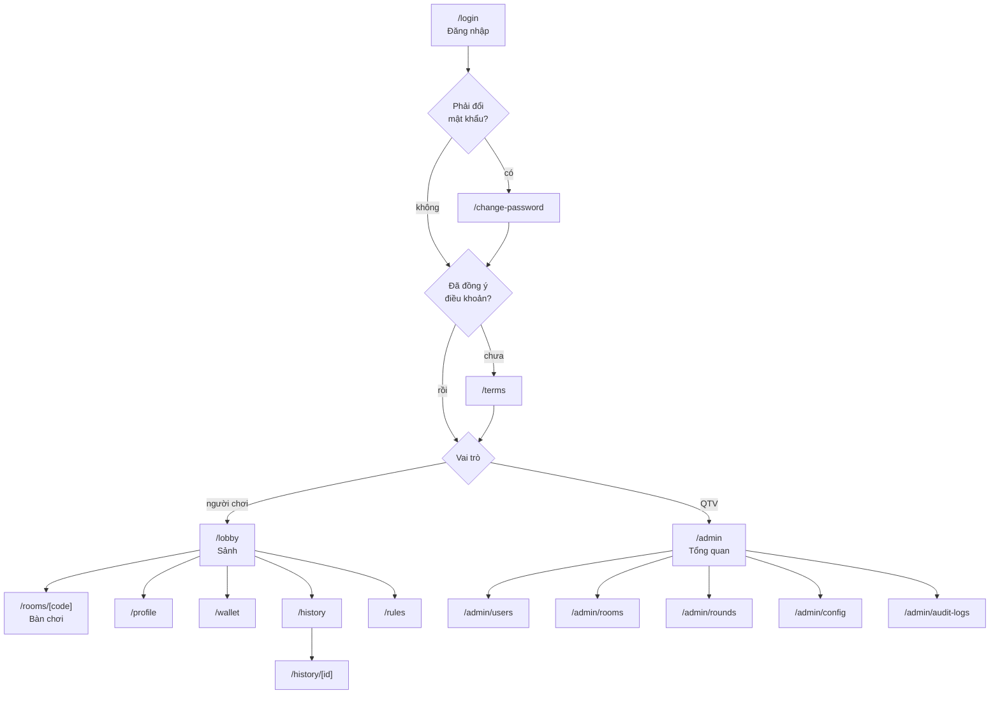

# Thiết kế giao diện: game Xì Dách

Phiên bản 1.0 · 07/10/2026 · Trạng thái: **đã chốt**

Đây là bước 3 trong [quy trình phát triển](00-quy-trinh-phat-trien.md), dựa trên [phân tích yêu cầu 1.0](01-phan-tich-yeu-cau.md), [thiết kế hệ thống 1.0](02-thiet-ke-he-thong.md) và [luật chơi 0.7](luat-xi-dach.md).

Kèm theo tài liệu này là **mockup trực quan** [03-mockup/mockup.html](03-mockup/mockup.html). Mở file bằng trình duyệt để xem bàn chơi trên máy tính, bàn chơi trên điện thoại xoay ngang và sảnh, dùng chính ảnh bài của dự án.

## 1. Định hướng

- **Phong cách:** theo bộ nhận diện "Meta Radar" của dự án meta-wildrift, kiểu giao diện HUD của game:
  - nền tím than rất tối, có lưới mờ và quầng sáng;
  - điểm nhấn xanh cyan neon, tím và vàng;
  - khung góc vát, có viền phát sáng;
  - nhãn và nút hình bình hành;
  - chữ tiêu đề đứng, đậm, viết hoa.
- **Mặt bàn:** hình bầu dục kiểu màn hình radar (vòng tròn đồng tâm mờ, viền cyan phát sáng), thay cho bàn nỉ xanh truyền thống.
- **Hoạt ảnh:** ít và có ý nghĩa: chia bài, rút bài, lật bài, cộng trừ xu.
- **Giao diện tối:** chỉ có giao diện tối, cho cả trang chơi lẫn trang quản trị (E1).
- **Ưu tiên 1:** người chơi nhìn bàn là biết ngay ai đang tới lượt, mình đang mấy nút, còn bao nhiêu giây.
- **Ưu tiên 2:** nút hành động to, rõ, chỉ hiện khi dùng được [USA-03].
- **Ưu tiên 3:** chơi thoải mái trên điện thoại xoay ngang, khi chiều cao chỉ khoảng 360 px [COMP-02].

## 2. Hệ thống thiết kế

### 2.1 Màu

Mọi màu được khai báo thành biến CSS (theo cách của shadcn/ui), thành phần chỉ dùng tên biến, không dùng mã màu trực tiếp.

Bộ màu lấy theo `meta-wildrift/src/css/tokens.css`, đổi tên cho đúng nghĩa trong game.

| Biến | Mã màu | Dùng cho |
|---|---|---|
| `--bg-0`, `--bg-1`, `--bg-2` | #06050D, #0B0A1B, #141130 | nền trang (chuyển màu chéo từ `--bg-2` về `--bg-0`) |
| `--panel`, `--panel-2` | rgba(22,18,48,.82), rgba(14,11,32,.86) | khung, thẻ, khung tên trên ghế (chuyển màu từ trên xuống) |
| `--stroke`, `--stroke-2` | trắng 9%, trắng 18% | đường viền |
| `--text`, `--text-2`, `--text-3` | #F6F4FF, #CBC6E8, #8D87B3 | chữ chính, chữ phụ, chữ mờ |
| `--accent` | #38E1FF | điểm nhấn chính: nút chính, đang tới lượt, viền focus, nhãn nhỏ |
| `--accent-2` | #8B5CFF | tím, dùng trong dải màu chuyển cyan → tím |
| `--gold` | #FFCF6B | cái, xu, nút Dằn |
| `--ink` | #07061A | chữ tối đặt trên nền sáng (nút, nhãn màu) |
| `--win` | #2CF5A0 | thắng |
| `--lose` | #FF3D6E | thua, mất kết nối, thao tác nguy hiểm |
| `--draw` | #8FB0FF | hòa, đã dằn |
| `--penalty` | #FFC53D | bị phạt (non, đền) |
| `--special` | #C07CFF | bài đặc biệt (xì bàn, xì dách, ngũ linh) |
| mặt bàn | #231C5C → #17123F → #0D0B26 | chuyển màu từ giữa ra mép, viền cyan phát sáng |

**Độ tương phản đã kiểm tra** (chuẩn WCAG; chữ cần từ 4,5:1, viền và đường nét cần từ 3:1) [USA-05]:

| Cặp màu | Tỉ lệ |
|---|---|
| chữ chính trên nền trang | 18,65 : 1 |
| chữ phụ, chữ mờ trên khung | 10,99; 5,37 : 1 |
| chữ mờ trên nền trang | 6,04 : 1 |
| cyan, vàng trên khung | 11,50; 12,37 : 1 |
| màu thắng, thua, hòa, bị phạt, bài đặc biệt trên nhãn trạng thái | 13,53; 5,67; 9,06; 12,27; 6,98 : 1 |
| chữ tối trên nút cyan, trên đầu tím của dải màu, trên nút vàng | 12,74; 9,28; 13,70 : 1 |
| chữ tối trên tím đậm (ô mã phòng) | 4,83 : 1 |
| chữ chính, chữ phụ trên mặt bàn | 13,87; 9,18 : 1 |
| viền focus cyan trên nền trang, trên mặt bàn | 12,93; 9,61 : 1 |

### 2.2 Chữ

Dùng 3 font như Meta Radar. Cả 3 đều có bộ ký tự tiếng Việt và được tự host bằng `next/font`.

| Font | Vai trò | Ví dụ |
|---|---|---|
| Saira Extra Condensed (700–900) | chữ đứng, rất đậm, viết hoa: logo, tiêu đề trang, số lớn, chữ trên nút ở bàn chơi | "CHỌN BÀN ĐỂ CHƠI", số nút "21", nút "RÚT" |
| Chakra Petch (500–700, có in nghiêng) | chữ kiểu HUD: nhãn nhỏ viết hoa giãn chữ, tên người chơi, chip, số xu, mã phòng | "XÌ DÁCH · SẢNH CHỜ", "ĐÃ DẰN", "K7M2QX" |
| Be Vietnam Pro (400–800) | chữ đọc: mô tả, nội dung, form, bảng | "4 / 5 phòng đang mở" |

- **Dấu chồng:** font chữ đứng dễ bị cắt dấu chồng (Ệ, Ỗ, Ữ). Vì vậy chữ Saira đặt `line-height` từ 1,15 và thêm khoảng đệm phía trên.
- **Chữ số:** mọi con số (xu, nút, giây) dùng chữ số đều độ rộng (`tabular-nums`) để không bị nhảy khi đổi giá trị.
- **Nhãn nhỏ HUD:** Chakra Petch 700, viết hoa, giãn chữ 0,12–0,24em.

| Cỡ | Dùng cho |
|---|---|
| 12 px | nhãn nhỏ HUD; chữ phụ trên điện thoại (số xu dưới tên) |
| 14–15 px | chữ thường trên trang, tên người chơi trên ghế |
| 16 px | ô nhập, nội dung đọc |
| 18 px | tên phòng, tiêu đề thẻ |
| 30–34 px | chữ trên nút Rút, Dằn; băng "Lượt của bạn" |
| 48–56 px | tiêu đề trang |
| 74 px | số nút của mình trên bàn (máy tính) |

### 2.3 Khoảng cách, bo góc, đổ bóng

- **Khoảng cách:** bậc 4 px (4, 8, 12, 16, 24, 32, 48). Các vùng bấm cạnh nhau cách nhau ít nhất 8 px.
- **Bo góc:**
  - 7 px cho chip, nhãn;
  - 11 px cho ô nhập, nút thường, ảnh đại diện (vuông bo góc);
  - 18–20 px cho thẻ phòng, khung lớn, hộp thoại.
  - Lá bài giữ đúng góc bo của ảnh bài.
- **Hình khối đặc trưng:**
  - **Góc vát:** khung tên trên ghế và ô mã phòng cắt vát 2 góc chéo (10 px, dùng `clip-path`).
  - **Hình bình hành:** băng "Lượt của bạn", nút Rút, nút Dằn và nhãn "21" của logo có hình bình hành, chữ nghiêng −8°.
  - **Thanh màu:** cạnh trái mỗi khung tên có một thanh màu 3 px theo trạng thái của ghế: cyan khi đang tới lượt, vàng với cái, xanh khi thắng, đỏ khi thua hoặc mất kết nối.
- **Ánh sáng:** phần tử quan trọng có quầng sáng cùng màu (`drop-shadow`, `box-shadow`): nút chính, ghế đang tới lượt, viền bàn, huy hiệu CÁI. Không dùng đổ bóng nhiều lớp phức tạp.
- **Nền:** lưới 56 px mờ dần ra mép, cộng 2 quầng sáng cyan và tím.

### 2.4 Chuyển động

| Hoạt ảnh | Thời gian | Ghi chú |
|---|---|---|
| Rê chuột, bấm nút | 150 ms | |
| Mở, đóng hộp thoại | 200 ms mở, 150 ms đóng | đóng nhanh hơn mở |
| Chia một lá từ bài tì tới ghế | 300 ms, mỗi lá cách nhau 120 ms | |
| Lật bài | 350 ms | |
| Số xu cộng, trừ | 600 ms | chữ +300 nổi lên rồi mờ dần |
| Thanh đếm giờ dưới khung tên | chạy liên tục | dải màu cyan → tím; còn 5 giây thì đổi sang màu thua và phát tiếng tích tắc |

- Đường cong chuyển động: ease-out khi xuất hiện, ease-in khi biến mất.
- Mỗi lúc chỉ có 1–2 thứ chuyển động trên màn hình.
- Người dùng bật "giảm chuyển động" trong hệ điều hành (`prefers-reduced-motion`) thì bỏ hết hiệu ứng bay và lật, chỉ giữ hiệu ứng mờ dần ngắn hơn 150 ms.

### 2.5 Biểu tượng, ảnh, âm thanh

- **Biểu tượng:** bộ Lucide (đi kèm shadcn/ui). Không dùng emoji làm biểu tượng.
- **Ảnh bài:** WebP 360×540 xuất từ `assets/cards/svg` (mục 4.5 ghi kích thước hiển thị).
- **Ảnh đại diện:** bộ 12 ảnh con vật vẽ phẳng, lấy từ gói Animal Pack của Kenney (CC0) (E2).
- **Âm thanh:** lấy từ gói Casino Audio của Kenney (CC0): chia bài, rút, lật, thắng, thua, tích tắc 5 giây cuối. Mặc định âm lượng 60%, tắt được trong cài đặt [ROOM-11, PROF-04] (E3).

### 2.6 Định dạng

- **Xu:** dấu chấm ngăn hàng nghìn, kèm chữ "xu", ví dụ `10.200 xu`.
- **Số cộng, trừ:** luôn có dấu, ví dụ `+300`, `−200`. Dấu trừ dùng ký tự `−` (U+2212).
- **Thời gian:** `07/10/2026 14:05`, theo giờ Việt Nam [USA-06].
- **Tên lá bài khi đọc thành chữ** (cho trình đọc màn hình, lịch sử): "Át bích", "5 rô", "10 cơ", "K chuồn".

## 3. Bố cục và điều hướng

### 3.1 Khổ màn hình

| Khổ | Chiều rộng | Ghi chú |
|---|---|---|
| Điện thoại dọc | dưới 640 px | các trang thường dùng một cột; bàn chơi hiện lời nhắc xoay ngang |
| Điện thoại ngang | chiều cao dưới 480 px | bố cục bàn chơi thu gọn (mockup khung 2) |
| Máy tính bảng | 640–1023 px | |
| Máy tính | từ 1024 px | bố cục đầy đủ (mockup khung 1 và 3) |

Không bao giờ có thanh cuộn ngang; không chặn phóng to trang.

### 3.2 Sơ đồ màn hình



### 3.3 Khung trang

- **Trang người chơi:**
  - Trên máy tính: menu dọc bên trái (giống Meta Studio, xem mockup khung 3). Từ trên xuống gồm:
    - logo;
    - các mục Sảnh, Lịch sử ván, Ví xu, Hướng dẫn, Hồ sơ (mục đang mở có nền cyan mờ và viền cyan);
    - ở đáy: thẻ số dư (số xu lớn màu vàng), tên người chơi, nút Đăng xuất.
  - Trên điện thoại: thanh trên cùng chỉ còn logo, số xu và nút menu; menu trượt ra từ cạnh trái.
- **Bàn chơi:** chiếm toàn màn hình, không có thanh menu chung.
- **Trang quản trị:** menu dọc bên trái; ưu tiên dùng trên máy tính.

### 3.4 Các luồng chính

**Lần đăng nhập đầu tiên:**

1. QTV tạo tài khoản và gửi mật khẩu tạm cho người chơi.
2. Người chơi đăng nhập và bị chuyển sang trang đổi mật khẩu.
3. Đổi xong thì sang trang điều khoản, đồng ý thì vào sảnh.

**Chơi một ván:**

1. Ở sảnh, vào một phòng và ngồi vào ghế trống.
2. Nếu được mời làm cái thì trả lời nhận hoặc từ chối.
3. Cái bấm Bắt đầu. Nếu bàn cược tự do thì các con đặt cược.
4. Đến lượt mình thì rút hoặc dằn.
5. Cái xét từng con.
6. Bảng kết quả hiện 5 giây, rồi bàn chuyển sang ván mới.

**Nạp xu:** QTV vào Người dùng, chọn người chơi, bấm "Nạp / trừ xu", nhập số xu và lý do.

## 4. Các màn hình

Wireframe dưới đây chỉ thể hiện bố cục và nội dung. Màu, cỡ chữ và chuyển động theo mục 2. Ký hiệu `[...]` là nút, `[____]` là ô nhập, `( )` và `(•)` là lựa chọn một trong nhiều.

### 4.1 Đăng nhập [PUB-01, AUTH-03]

```
┌──────────────────────────────────────────────┐
│                [logo] Xì Dách                │
│   ┌──────────────────────────────────────┐   │
│   │ Đăng nhập                            │   │
│   │ Tên đăng nhập                        │   │
│   │ [__________________________________] │   │
│   │ Mật khẩu                             │   │
│   │ [____________________________][Hiện] │   │
│   │ [x] Ghi nhớ đăng nhập                │   │
│   │ [            Đăng nhập             ] │   │
│   │ Chưa có tài khoản? Liên hệ quản trị viên. │
│   └──────────────────────────────────────┘   │
└──────────────────────────────────────────────┘
```

- **Lỗi:** hiện ngay dưới nút Đăng nhập (mục 7).
- **Bị khóa vì nhập sai:** báo số phút còn phải chờ.
- **Bị QTV khóa:** báo thời hạn và lý do.
- **Ô nhập:** cho dán và cho trình quản lý mật khẩu tự điền (`autocomplete="username"`, `"current-password"`).

### 4.2 Đổi mật khẩu [AUTH-06, AUTH-12]

```
┌ Đổi mật khẩu ──────────────────────────────────┐
│ (!) Bạn cần đổi mật khẩu trước khi vào chơi.   │  ← chỉ hiện khi bị bắt buộc
│ Mật khẩu hiện tại  [________________________]  │
│ Mật khẩu mới       [________________________]  │
│   [x] Ít nhất 8 ký tự  [x] Có chữ  [ ] Có số   │  ← cập nhật ngay khi gõ
│ Nhập lại           [________________________]  │
│ [ Đổi mật khẩu ]                  [Đăng xuất]  │
└────────────────────────────────────────────────┘
```

### 4.3 Điều khoản [PUB-03]

```
┌ Điều khoản sử dụng ────────────────────────────┐
│ 1. Xu trong game là xu ảo, không có giá trị    │
│    quy đổi ra tiền hay vật phẩm.               │
│ 2. Không mua bán, trao đổi xu dưới mọi hình    │
│    thức.                                       │
│ 3. Người chơi phải từ 18 tuổi trở lên.         │
│ 4. Hệ thống chỉ lưu tên đăng nhập, tên hiển    │
│    thị và dữ liệu chơi.                        │
│ [ ] Tôi từ 18 tuổi trở lên và đồng ý điều khoản │
│ [ Đồng ý và vào sảnh ]            [Đăng xuất]  │
└────────────────────────────────────────────────┘
```

Nút "Đồng ý và vào sảnh" chỉ bấm được khi đã tích ô đồng ý.

### 4.4 Sảnh [LOB-01…04]

- **Trên máy tính:** xem mockup khung 3.
  - Đầu trang là khung tiêu đề gồm nhãn nhỏ "XÌ DÁCH · SẢNH CHỜ", tiêu đề lớn và số phòng, số người online. Bên phải khung có ô nhập mã phòng, nút Vào và nút Tạo phòng.
  - Dưới khung tiêu đề là các tab lọc kèm số đếm (Tất cả, Đang chờ, Đang chơi, Còn ghế).
- **Mỗi thẻ phòng gồm:**
  - Phần hình ở trên: một bàn radar thu nhỏ với 8 ô ghế (ô vàng là cái, ô sáng là ghế đã có người); nhãn trạng thái (Đang chờ, Đang chơi); biểu tượng khóa nếu phòng có mật khẩu.
  - Tên phòng viết hoa và mã phòng.
  - Chip kiểu cược và mức cược (vàng), chip chế độ làm cái (cyan).
  - Số ghế đã ngồi, ví dụ "7/8", và nút Vào phòng.
- **Không đủ xu:** nút Vào phòng bị khóa, kèm dòng "Cần … xu để vào ván". Vẫn được vào xem.
- **Đã đủ số phòng tối đa:** nút Tạo phòng bị khóa, kèm dòng "Đã đủ 5 phòng đang mở".

Trên điện thoại cầm dọc:

```
┌──────────────────────────────┐
│ [logo] Xì Dách  10.200 xu [≡]│
├──────────────────────────────┤
│ Sảnh            [+ Tạo phòng]│
│ [Nhập mã phòng_______] [Vào] │
│ (Tất cả) (Còn ghế) (Cố định) →│  ← các bộ lọc, cuộn ngang trong hàng
│ ┌──────────────────────────┐ │
│ │ Bàn vui       Đang chơi  │ │
│ │ Mã K7M2QX                │ │
│ │ Tự do 100–1.000 · Xoay tua│ │
│ │ ●●●●●●●○       [Vào xem] │ │
│ └──────────────────────────┘ │
│ ┌──────────────────────────┐ │
│ │ ...                      │ │
└──────────────────────────────┘
```

**Hộp thoại Tạo phòng** [LOB-03]:

```
┌ Tạo phòng ─────────────────────────────── [x] ┐
│ Tên phòng   [Bàn vui__________________]  7/30 │
│ Làm cái     (•) Cố định   ( ) Xoay tua        │
│             Số ván mỗi lượt [3 ▾]   ← khi xoay tua │
│ Đặt cược    (•) Cố định   ( ) Tự do           │
│             Mức cược [200______] xu           │
│             ← tự do: Tối thiểu [100] Tối đa [1.000] │
│ Mật khẩu    [____________] (không bắt buộc)   │
│ Mức cược cho phép từ 100 đến 10.000 xu.       │
│                          [Hủy]  [Tạo phòng]   │
└───────────────────────────────────────────────┘
```

**Hộp thoại Mật khẩu phòng** [LOB-04]: một ô mật khẩu cùng 2 nút "Hủy" và "Vào phòng"; nhập sai thì báo lỗi ngay dưới ô.

### 4.5 Bàn chơi [ROOM-*, GAME-*]

Xem mockup khung 1 (máy tính) và khung 2 (điện thoại xoay ngang).

**Vị trí trên màn hình.** Bàn được xoay theo người xem: **ghế của mình luôn ở dưới giữa** (E5). Các ghế còn lại xếp theo chiều kim đồng hồ: dưới trái, trái, trên trái, trên giữa, trên phải, phải, dưới phải. Người xem (không ngồi ghế) thấy ghế số 0 ở dưới giữa.

```
                [trên trái]  [trên giữa]  [trên phải]
            ╭──────────────────────────────────────╮
    [trái]  │   bài tì · Lượt của Hùng · 12 giây   │  [phải]
            │   Ván 12 · Bài tì còn 33 lá          │
            ╰──────────────────────────────────────╯
             [dưới trái]  [bài của mình]  [dưới phải]
                          [   21 nút   ]          [Rút R] [Dằn D]
   3 người xem                [mình]
```

**Một ghế gồm:**

```
        [lá][lá][lá]             ← lưng bài (số lá) hoặc bài đã lật
  ┃ [A]  TÊN NGƯỜI CHƠI   ◆CÁI   ← khung góc vát; thanh màu bên trái theo trạng thái;
  ┃      10.200 · cược 200          ảnh đại diện vuông bo góc; huy hiệu CÁI hình khiên vàng
  ┗━━━━━━━━━━━━━━━━━━━━━━━━━━┛   ← thanh đếm giờ cyan → tím khi tới lượt
     [ĐÃ DẰN]                    ← nhãn trạng thái viền màu, phát sáng nhẹ
```

Nhãn trạng thái: Chờ lượt (mờ), Đang rút… (cyan), Đã dằn (xanh nhạt), Mất kết nối (đỏ), Xì bàn / Xì dách / Ngũ linh (tím), +300 (xanh), −200 (đỏ), Hòa (xanh nhạt), Bị phạt (vàng cam). Chủ phòng có thêm biểu tượng vương miện nhỏ cạnh tên.

- **Trạng thái của con khác:** chỉ hiện "Đã dằn", không bao giờ hiện quắc hay đền trước khi bài được lật [FAIR-02].
- **Kết quả đã chốt:** hiện cả chữ lẫn màu (Thắng +300, Thua −200, Hòa, Bị phạt), không chỉ dựa vào màu.
- **Ghế trống:** hiện nút "Ngồi vào ghế" với người xem.

**Kích thước lá bài:**

| Lá bài | Máy tính | Điện thoại ngang |
|---|---|---|
| Bài của mình | 96 × 144 px | 52 × 78 px |
| Bài người khác, bài tì | 40 × 60 px | 22 × 33 px |
| Lá thu nhỏ trong lịch sử | 32 × 48 px | 32 × 48 px |

**Bài của mình:**
- Các lá xếp chồng một phần, có quầng sáng cyan nhẹ bên dưới.
- Bên phải bài là tổng nút viết bằng số lớn (Saira, chuyển màu trắng → cyan) kèm nhãn nhỏ "NÚT"; nút tính A theo luật mục 3.
- Nếu là bài đặc biệt hoặc bị phạt thì có thêm nhãn loại bài: Xì bàn, Xì dách, Ngũ linh, Quắc, Non, Đền.

**Giữa bàn:** bài tì, băng hình bình hành "LƯỢT CỦA BẠN · 12s" (hoặc "LƯỢT CỦA HÙNG"), dòng nhỏ "VÁN 12 · BÀI TÌ 33 LÁ".

**Nút hành động theo vai trò và pha** [USA-03]:

| Ai | Pha | Nút |
|---|---|---|
| Người xem | bất kỳ | "Ngồi vào ghế" trên ghế trống |
| Người ngồi ghế | TamDung (không ai nhận làm cái) | Nhận làm cái |
| Cái | ChoBatDau | Bắt đầu, kèm đếm ngược 15 giây |
| Con | DatCuoc, bàn tự do | chọn mức cược (mục dưới) |
| Con đang tới lượt | LuotCon | Rút, Dằn |
| Cái | LuotCai | Rút, Dằn hẳn; nút "Xét" hiện trên từng ghế con chưa chốt khi cái có từ 15 nút |
| Mọi người | KetQua | không có nút; bảng kết quả hiện 5 giây |

- **Vị trí nút:** trên máy tính nằm bên phải bài của mình; trên điện thoại xếp dọc ở góc phải dưới.
- **Kiểu nút:**
  - Hình bình hành, chữ Saira viết hoa và nghiêng.
  - Nút Rút có dải màu cyan → tím; nút Dằn màu vàng; cả hai có quầng sáng cùng màu.
  - Trên máy tính có ô gợi ý phím tắt ngay trên nút.
- **Kích thước nút:** cao ít nhất 44 px [USA-05].

**Chọn mức cược (bàn tự do):**

```
┌ Đặt cược · còn 8 giây ─────────────────────────┐
│ [100] [200] [500] [1.000]     ← tối thiểu, ×2, ×5, tối đa │
│ [−]  [ 300 xu ]  [+]          ← bước tăng bằng mức tối thiểu │
│                     [ Đặt cược ]               │
└────────────────────────────────────────────────┘
```

Không đặt quá số dư. Hết giờ mà chưa đặt thì game tự đặt theo luật 5.4.

**Thanh trên cùng:**
- **Bên trái:** tên phòng, mã phòng (bấm để sao chép liên kết mời), chế độ làm cái (kèm số ván còn lại nếu xoay tua) và kiểu cược.
- **Bên phải:** nút âm thanh, nút menu "⋮" và nút Rời phòng.
- **Menu "⋮"** chỉ hiện mục người đó dùng được:
  - Đổi cái (chủ phòng, chế độ cố định);
  - Chuyển quyền chủ phòng;
  - Mời ra khỏi phòng;
  - Xin nghỉ làm cái (cái);
  - Đứng dậy;
  - Luật chơi (mở trang hướng dẫn ở tab mới).

**Các hộp thoại và thông báo trên bàn:**

| Tình huống | Hiển thị |
|---|---|
| Được mời làm cái | hộp thoại đếm ngược 10 giây: "Bạn có nhận làm cái không?", 2 nút [Từ chối] [Nhận làm cái], kèm ô "Không hỏi lại" (bật tùy chọn Không nhận làm cái) [ROOM-06] |
| Con dằn khi dưới 16 nút | hộp xác nhận: "Bạn đang có 14 nút. Dằn bây giờ là non và bạn sẽ bị phạt trả thay cái. Vẫn dằn?", 2 nút [Rút tiếp] [Vẫn dằn]. Nút được chọn sẵn là Rút tiếp |
| Cái dằn hẳn khi dưới 15 nút | hộp xác nhận tương tự, nói rõ cái sẽ phải đền làng |
| Kết quả ván | bảng hiện 5 giây; mỗi dòng gồm tên, bài thu nhỏ, loại bài, kết quả, số xu; dòng của mình được tô nổi; tổng của mình ghi trên cùng [GAME-08] |
| Không ai nhận làm cái | băng thông báo giữa bàn: "Chưa có ai làm cái", kèm nút Nhận làm cái |
| Mất kết nối | băng màu vàng trên cùng: "Mất kết nối. Đang kết nối lại…"; nối lại được thì báo "Đã kết nối lại" [USA-04] |
| Phiên khác tiếp quản, bị khóa, mật khẩu đã đổi | hộp thoại không đóng được, ghi lý do, nút [Về trang đăng nhập] |
| Ván bị hủy | "Ván bị hủy do sự cố. Không ai bị trừ xu." |
| Phòng bị đóng | báo lý do rồi đưa về sảnh |
| Điện thoại cầm dọc | màn che toàn trang: biểu tượng xoay và dòng "Xoay ngang điện thoại để chơi" [COMP-02] |

**Phím tắt trên máy tính** (gợi ý phím hiện ngay trên nút):

| Phím | Việc làm |
|---|---|
| R | Rút |
| D | Dằn (con) hoặc Dằn hẳn (cái) |
| 1–7 | cái xét con ở vị trí 1–7 |
| Enter | cái bấm Bắt đầu |
| Esc | đóng hộp thoại (trừ hộp thoại bắt buộc) |

**Thông báo cho trình đọc màn hình** (một vùng `aria-live` duy nhất, đọc lịch sự, không giành focus):

- "Đến lượt bạn. Bạn có 15 giây."
- "Bạn rút được 5 rô. Tổng 21 nút."
- "Cái xét bạn: bạn thắng 200 xu."
- "Ván kết thúc. Bạn được 300 xu."

### 4.6 Hồ sơ [PROF-01…04, HIS-03]

```
┌ Hồ sơ ──────────────────────────────────────────────┐
│ ( ảnh )  Lan  [Đổi tên]          Tham gia 01/10/2026 │
│ Ảnh đại diện: (1)(2)(3)(4)(5)(6)(7)(8)(9)(10)(11)(12) │
│ Thống kê                                            │
│  Ván đã chơi 126 · Thắng 58 · Thua 60 · Hòa 8         │
│  Xì bàn 1 · Xì dách 7 · Ngũ linh 2                    │
│  Quắc 14 · Non 0 · Đền 1                              │
│  Ván làm cái 30 · Lãi/lỗ +2.300 xu                    │
│ Cài đặt                                             │
│  Âm thanh                    [bật ]                 │
│  Không nhận làm cái          [ tắt]                 │
│ [Đổi mật khẩu]                                       │
└─────────────────────────────────────────────────────┘
```

### 4.7 Ví xu [WAL-01]

```
┌ Ví xu ───────────────────────────────────────────────┐
│ Số dư hiện tại: 10.200 xu                             │
│ (Tất cả loại ▾) (Từ ngày [__]) (Đến ngày [__])        │
│ Thời gian    │ Loại        │ Số xu  │ Số dư sau │ Ván  │
│ 07/10 14:05  │ Thắng ván   │ +300   │ 10.200    │ #12  │
│ 06/10 20:11  │ QTV nạp     │ +5.000 │ 9.900     │      │
│ 01/10 09:00  │ Xu ban đầu  │ +10.000│ 10.000    │      │
│                                        ‹ 1 2 3 ›      │
└───────────────────────────────────────────────────────┘
```

Trên điện thoại, bảng chuyển thành danh sách dòng: loại và thời gian ở dòng trên, số xu và số dư ở dòng dưới.

### 4.8 Lịch sử ván [HIS-01, HIS-02]

```
┌ Lịch sử ván ────────────────────────────────────────────────┐
│ Thời gian   │ Phòng   │ Vai trò │ Bài        │ Loại   │ Kết quả │ Xu   │
│ 07/10 14:05 │ Bàn vui │ Con     │ [AS][5D][6C]│ 21 nút │ Thắng   │ +200 │
│ 07/10 14:01 │ Bàn vui │ Cái     │ [9H][KD]   │ 19 nút │ –       │ +100 │
└─────────────────────────────────────────────────────────────┘
```

Bấm một dòng để mở trang xem lại ván (Could): dòng thời gian từng bước, chỉ gồm các lá đã lật trong ván.

### 4.9 Hướng dẫn luật chơi [PUB-02]

Trang đọc có mục lục bên trái (máy tính) hoặc ở đầu trang (điện thoại). Nội dung viết lại từ luat-xi-dach.md theo giọng dành cho người chơi, có hình lá bài trong các ví dụ tính điểm và tính tiền.

### 4.10 Trang quản trị [ADM-*]

**Khung trang và danh sách người dùng** [ADM-03, ADM-15]:

```
┌───────────────┬───────────────────────────────────────────────────────────┐
│ [logo] Quản trị│ Người dùng                                    admin ▾    │
│               ├───────────────────────────────────────────────────────────┤
│ Tổng quan     │ [Tìm theo tên________] (Vai trò ▾) (Trạng thái ▾) [+ Tạo tài khoản] │
│ Người dùng  ● │ Tên đăng nhập │ Tên hiển thị │ Vai trò    │ Trạng thái │ Số dư  │ Đăng nhập gần nhất │
│ Phòng         │ lan_nguyen    │ Lan          │ Người chơi │ Hoạt động  │ 10.200 │ 5 phút trước       │
│ Ván           │ hung          │ Hùng         │ Người chơi │ Bị khóa    │ 4.800  │ 2 ngày trước       │
│ Cấu hình      │ admin         │ Quản trị     │ QTV        │ Hoạt động  │ –      │ vừa xong           │
│ Nhật ký       │                                                ‹ 1 2 ›   │
│ Thông báo     │                                                          │
│ Bảo trì       │                                                          │
└───────────────┴───────────────────────────────────────────────────────────┘
```

**Tạo tài khoản và mật khẩu tạm** [ADM-15, WAL-02]:

```
┌ Tạo tài khoản ──────────────────────────── [x] ┐   ┌ Đã tạo tài khoản ───────────────────────┐
│ Tên đăng nhập [lan_nguyen_______]              │   │ Gửi thông tin này cho người chơi.       │
│ Tên hiển thị  [Lan______________]              │   │ Tên đăng nhập: lan_nguyen               │
│ Vai trò       (•) Người chơi ( ) Quản trị viên │ → │ Mật khẩu tạm:  K7m2-Qx9p-Wd4h [Sao chép] │
│ Mật khẩu tạm  (•) Tạo ngẫu nhiên ( ) Tự nhập   │   │ (!) Mật khẩu chỉ hiện một lần. Người    │
│ Xu ban đầu    [10.000___] (chỉ với người chơi) │   │ chơi phải đổi mật khẩu khi đăng nhập.   │
│                       [Hủy] [Tạo tài khoản]    │   │                              [Đã lưu]   │
└────────────────────────────────────────────────┘   └─────────────────────────────────────────┘
```

**Chi tiết người dùng** [ADM-03…07, ADM-16]:

```
┌ lan_nguyen · Lan   [Người chơi] [Hoạt động]                 Số dư 10.200 xu ┐
│ [Nạp / trừ xu] [Đặt lại mật khẩu] [Khóa] [Đổi vai trò] [Xóa tài khoản]      │
│ Tạo lúc 01/10/2026 · Đăng nhập gần nhất 07/10/2026 14:05                    │
│ (Giao dịch) (Ván đã chơi) (Lệnh nạp, trừ)                                   │
│ Thời gian   │ Loại      │ Số xu  │ Số dư sau │ Ván, lý do                    │
│ 07/10 14:05 │ Thắng ván │ +300   │ 10.200    │ #12                           │
│ 06/10 20:11 │ QTV nạp   │ +5.000 │ 9.900     │ Nạp tuần 41 (admin)           │
└─────────────────────────────────────────────────────────────────────────────┘
```

| Hộp thoại | Nội dung |
|---|---|
| Nạp / trừ xu | chọn Nạp hoặc Trừ; số xu; lý do (bắt buộc). Nếu người đó đang trong ván thì ghi chú "Lệnh sẽ được áp dụng khi ván kết thúc" |
| Đặt lại mật khẩu | xác nhận, rồi hiện mật khẩu tạm một lần như khi tạo tài khoản |
| Khóa | thời hạn: 1 giờ, 1 ngày, 7 ngày, vĩnh viễn hoặc tự chọn; lý do (bắt buộc) |
| Đổi vai trò | chọn vai trò; không cho thu quyền QTV cuối cùng |
| Xóa tài khoản | gõ lại tên đăng nhập để xác nhận; báo trước số xu còn lại sẽ bị trừ hết |

**Tổng quan** [ADM-02]:

```
┌ Tổng quan ───────────────────────────────────────────────────────────────┐
│ [Đang online 18] [Phòng 4/5 · 3 đang chơi] [Ván hôm nay 126] [Xu lưu hành 1.250.000] │
│ Đối soát xu gần nhất: 07/10 03:00 · Khớp                                  │
│ Thao tác quản trị gần đây                                                │
│  14:00 admin  Nạp 5.000 xu cho lan_nguyen · "Nạp tuần 41"                 │
└──────────────────────────────────────────────────────────────────────────┘
```

Đối soát lệch thì thẻ đối soát chuyển màu đỏ, kèm nút xem chi tiết.

**Phòng** [ADM-08]: bảng các phòng đang mở (mã, tên, chủ phòng, chế độ, cược, số người, trạng thái, giờ tạo). Bấm vào một phòng để xem bàn ở dạng chỉ đọc, tự làm mới mỗi 3 giây, không có bài úp. Nút [Đóng phòng] mở hộp thoại nhập lý do và cảnh báo ván đang chơi sẽ bị hủy.

**Ván** [ADM-09]: tìm theo mã ván, người chơi, khoảng thời gian. Trang chi tiết:

```
┌ Ván #12 · Bàn vui · 07/10/2026 14:05 · Đã tính tiền ─────────────────────┐
│ Mã băm bộ bài 3f9a…c21 · Kiểm tra: khớp                                   │
│ Ghế │ Vị trí │ Người │ Vai trò │ Cược │ Bài          │ Loại   │ Kết quả │ Xu   │
│ 0   │ 0      │ Nam   │ Cái     │ –    │ [8S][9D][2C] │ 19 nút │ –       │ +100 │
│ 3   │ 1      │ Hùng  │ Con     │ 200  │ [KH][7S]     │ 17 nút │ Thua    │ −200 │
│ Thứ tự bộ bài: [52 lá thu nhỏ]                                           │
│ Diễn biến                                                                │
│ 14:05:02  Hệ thống   Chia bài                                            │
│ 14:05:09  Lan        Rút 6C                                              │
│ 14:05:15  Nam (cái)  Xét Hùng: Hùng thua 200                             │
└──────────────────────────────────────────────────────────────────────────┘
```

**Cấu hình** [ADM-10]:

```
┌ Cấu hình hệ thống · phiên bản 3 ─────────────────────────────────────────┐
│ Thời gian (giây)  Nhận làm cái [10] Đặt cược [10] Mỗi quyết định [15]      │
│                   Tự bắt đầu [15] Hiện kết quả [5]                         │
│ Mốc điểm          Con đủ tuổi [16] Cái đủ tuổi [15] Quắc từ [22] Đền từ [28] │
│ Hệ số             Xì bàn [2] Xì dách [1] Ngũ linh [2]                       │
│ Xu tối thiểu      Vào ván [2] × mức cược · Làm cái [14] × mức cược          │
│                   Trả thay cái tối đa [12] × phần cược                     │
│ Phòng             Số phòng tối đa [5] · Mức cược từ [100] đến [10.000]      │
│                   Người xem tối đa [20]                                    │
│ Tài khoản mới     Xu ban đầu mặc định [10.000]                             │
│ (!) Thay đổi chỉ áp dụng cho phòng tạo sau khi lưu.                        │
│                                  [Bỏ thay đổi] [Lưu phiên bản mới]         │
│ Lịch sử: v3 · 07/10 14:00 · admin · Số phòng tối đa 4 → 5 [Xem]            │
└──────────────────────────────────────────────────────────────────────────┘
```

Số con tối đa (7) và số lá tối đa (5) gắn liền với bố cục bàn nên chỉ hiển thị, không cho sửa.

**Nhật ký quản trị** [ADM-11]: bảng gồm thời gian, QTV, hành động, đối tượng; lọc theo QTV, hành động, khoảng thời gian. Bấm một dòng để xem giá trị trước và sau.

**Thông báo và bảo trì** [ADM-12, ADM-13, Could]:
- **Thông báo:** danh sách thông báo kèm khoảng thời gian hiện.
- **Bảo trì:** một công tắc bật, tắt, có xác nhận và ghi rõ hệ quả.

## 5. Thành phần dùng chung

| Thành phần | Dùng ở | Ghi chú |
|---|---|---|
| AppShell, AdminShell | trang người chơi, trang quản trị | |
| Button: thường (viền mờ), chính (dải màu cyan → tím, chữ tối), nguy hiểm (viền và chữ đỏ) | mọi nơi | cao ít nhất 44 px; chữ Chakra Petch viết hoa; có trạng thái đang xử lý |
| TableButton: Rút, Dằn, Dằn hẳn, Bắt đầu, Nhận làm cái | bàn chơi | hình bình hành, chữ Saira nghiêng (mục 4.5) |
| Wordmark (logo chữ), CodeTag (ô mã phòng góc vát), StatusTag (nhãn trạng thái phát sáng), DealerBadge (khiên vàng "CÁI") | nhiều nơi | mục 2.3 |
| Input, PasswordInput, Select, RadioGroup, Switch, Checkbox | các form | nhãn luôn hiện, lỗi nằm ngay dưới ô |
| Dialog, AlertDialog, Sheet | hộp thoại, menu điện thoại | khóa focus trong hộp thoại; Esc để đóng |
| Toast (Sonner) | thông báo ngắn | 3 loại: thành công, lỗi, thông tin |
| DataTable | quản trị, ví, lịch sử | sắp xếp, phân trang 20 dòng |
| Badge, Chip, StatCard, RoomCard | nhiều nơi | |
| Avatar | ghế, menu, hồ sơ | vuông bo góc 11 px; thiếu ảnh thì dùng chữ cái đầu trên nền chuyển màu |
| PlayingCard | bàn chơi, lịch sử, quản trị | mặt bài, lưng bài, cỡ nhỏ; luôn có `alt` |
| Seat, Hand, CenterInfo, ActionBar, BetPicker, TurnTimer, ResultBoard | bàn chơi | mục 4.5 |
| ConnectionBanner, RotateDeviceOverlay | bàn chơi | |
| Skeleton, EmptyState, ErrorState | mọi trang có dữ liệu | mục 6 |

## 6. Trạng thái tải, trống, lỗi [USA-04]

| Trang | Đang tải | Trống | Lỗi |
|---|---|---|---|
| Sảnh | 3 thẻ phòng dạng khung xám | "Chưa có phòng nào đang mở." kèm nút Tạo phòng | "Không tải được danh sách phòng." kèm nút Thử lại |
| Bàn chơi | bàn mờ cùng dòng "Đang vào phòng…" | – | phòng không tồn tại hoặc đã đóng: báo rồi đưa về sảnh |
| Ví xu, lịch sử | các dòng bảng dạng khung xám | "Chưa có giao dịch." / "Bạn chưa chơi ván nào." | báo lỗi kèm nút Thử lại |
| Bảng quản trị | các dòng bảng dạng khung xám | "Không có kết quả phù hợp." | báo lỗi kèm nút Thử lại |

- Nút gửi form chuyển sang trạng thái đang xử lý và không bấm được lần nữa cho tới khi có kết quả.
- Thao tác thành công thì hiện toast thành công.

## 7. Câu chữ và thông báo lỗi [USA-01, USA-03]

**Thuật ngữ dùng trên giao diện:** cái, con, rút, dằn, xét, dằn hẳn, bài tì, nút, xì bàn, xì dách, ngũ linh, quắc, non, đền, đền làng, trả thay cái, chủ phòng, người xem. Không dùng từ khác cho cùng một khái niệm.

| Mã lỗi | Thông báo |
|---|---|
| INVALID_CREDENTIALS | Tên đăng nhập hoặc mật khẩu không đúng. |
| ACCOUNT_LOCKED (nhập sai nhiều lần) | Bạn nhập sai quá nhiều lần. Thử lại sau {n} phút. |
| ACCOUNT_LOCKED (QTV khóa) | Tài khoản bị khóa đến {thời điểm} (hoặc: vĩnh viễn). Lý do: {lý do}. |
| PASSWORD_CHANGE_REQUIRED | Bạn cần đổi mật khẩu trước khi tiếp tục. |
| TERMS_NOT_ACCEPTED | Bạn cần đồng ý điều khoản trước khi vào chơi. |
| FORBIDDEN | Bạn không có quyền làm việc này. |
| VALIDATION_FAILED | (hiện lỗi ngay dưới từng ô, ví dụ: "Tên phòng tối đa 30 ký tự.") |
| NOT_FOUND | Không tìm thấy {phòng, người dùng, ván}. |
| USERNAME_TAKEN | Tên đăng nhập này đã có người dùng. |
| DISPLAY_NAME_TAKEN | Tên hiển thị này đã có người dùng. |
| ROOM_LIMIT_REACHED | Đã đủ {n} phòng đang mở. Bạn hãy vào một phòng có sẵn. |
| ROOM_FULL | Bàn đã hết ghế trống. |
| SPECTATORS_FULL | Phòng đã đủ người xem. |
| ROOM_PASSWORD_INVALID | Mật khẩu phòng không đúng. |
| INSUFFICIENT_BALANCE | Bạn cần ít nhất {n} xu để {ngồi vào bàn, làm cái}. |
| LAST_ADMIN | Hệ thống phải còn ít nhất một quản trị viên. |
| USER_IN_ROUND | Người này đang trong ván. Thử lại sau khi ván kết thúc. |
| NOT_YOUR_TURN | Chưa tới lượt bạn. |
| INVALID_ACTION | Không thể làm việc này lúc này. |
| RATE_LIMITED | Bạn thao tác quá nhanh. Thử lại sau giây lát. |
| INTERNAL_ERROR | Có lỗi xảy ra. Bạn thử lại sau nhé. |

## 8. Trợ năng [USA-05]

- **Tương phản:** mọi cặp màu chữ và nền đạt từ 4,5:1; viền, đường nét đạt từ 3:1 (bảng ở mục 2.1).
- **Focus:** viền cyan 2 px, cách phần tử 2 px; không bao giờ bị ẩn.
- **Bàn phím:**
  - Mọi thao tác dùng được bằng bàn phím; bàn chơi có thêm phím tắt (mục 4.5).
  - Hộp thoại khóa focus bên trong và trả focus về chỗ cũ khi đóng.
  - Có liên kết "Bỏ qua tới nội dung" ở đầu trang.
- **Trình đọc màn hình:**
  - Lá bài có `alt` ("Át bích"); nút chỉ có biểu tượng có `aria-label`.
  - Diễn biến trong ván được đọc qua một vùng `aria-live` (mục 4.5).
- **Chạm:** vùng bấm từ 44 × 44 px; các vùng bấm cách nhau ít nhất 8 px.
- **Chuyển động:** tôn trọng tùy chọn giảm chuyển động (mục 2.4).
- **Form:**
  - Nhãn luôn hiện, không chỉ dùng chữ mờ trong ô; lỗi nằm ngay dưới ô.
  - Ô mật khẩu cho dán và cho trình quản lý mật khẩu tự điền.
- **Giới hạn thời gian:**
  - Đồng hồ mỗi lượt là một phần của trò chơi thời gian thực, thuộc ngoại lệ của tiêu chí WCAG 2.2.1.
  - Bù lại, đồng hồ luôn hiện cả vòng lẫn số giây; 5 giây cuối có âm báo; QTV chỉnh được thời gian lượt (ADM-10).
- **Không chỉ dùng màu:** kết quả luôn có chữ và dấu (+, −); chất bài phân biệt bằng hình trên lá bài.

## 9. Các quyết định đã chốt

| Mã | Câu hỏi | Quyết định |
|---|---|---|
| E1 | Chỉ làm giao diện tối, hay làm thêm giao diện sáng? | Chỉ giao diện tối. |
| E2 | Ảnh đại diện lấy ở đâu? | 12 ảnh con vật trong gói Animal Pack của Kenney (CC0, dùng tự do). |
| E3 | Âm thanh lấy ở đâu? | Gói Casino Audio của Kenney (CC0). |
| E4 | Tên game và logo? | Logo chữ giống kiểu "META RADAR": chữ "XÌ DÁCH" trắng chuyển cyan, kèm nhãn hình bình hành "21" màu cyan → tím, như trong mockup. |
| E5 | Ghế của mình có luôn nằm ở dưới giữa không (bàn xoay theo người xem)? | Có. |

## 10. Lịch sử thay đổi

- **1.0 (07/10/2026):** chốt bước 3 và các quyết định E1–E5.
- **0.2 (07/10/2026):** đổi toàn bộ phong cách theo bộ nhận diện Meta Radar của dự án meta-wildrift. Thay đổi gồm:
  - bộ màu mới, đã kiểm tra lại độ tương phản;
  - 3 font Saira Extra Condensed, Chakra Petch, Be Vietnam Pro;
  - mặt bàn kiểu radar, khung ghế góc vát, nút hình bình hành;
  - sảnh có menu dọc bên trái;
  - logo chữ "XÌ DÁCH" kèm nhãn "21".
  - Mockup được làm lại theo phong cách mới.
- **0.1 (07/10/2026):** bản nháp đầu tiên, kèm mockup.
